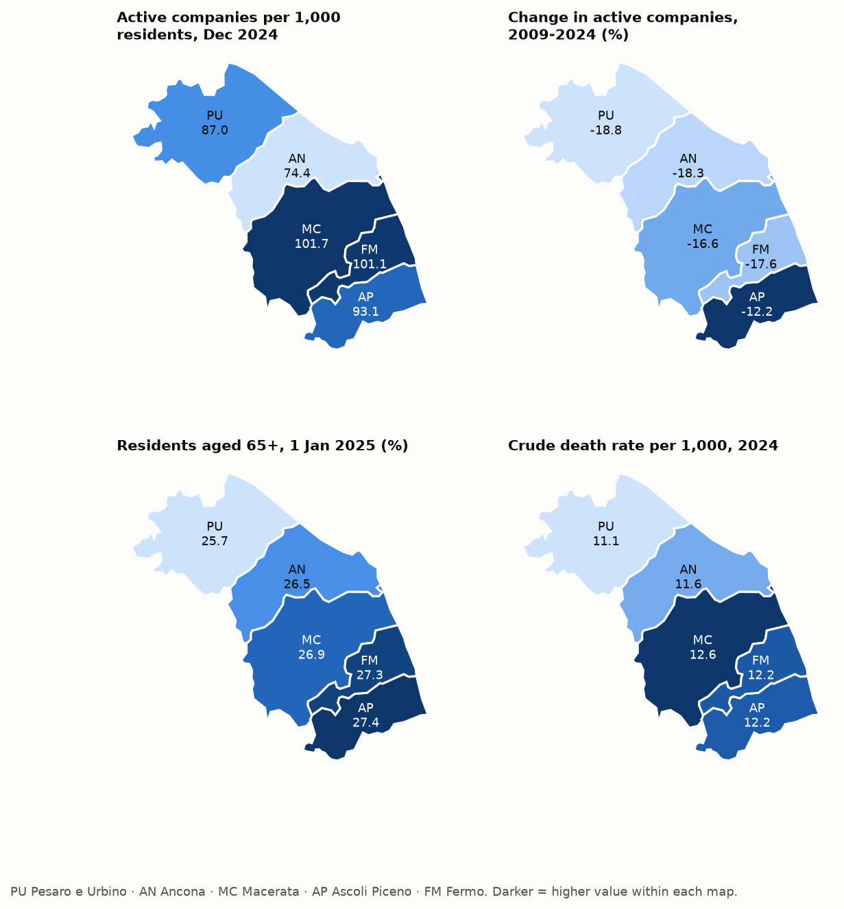
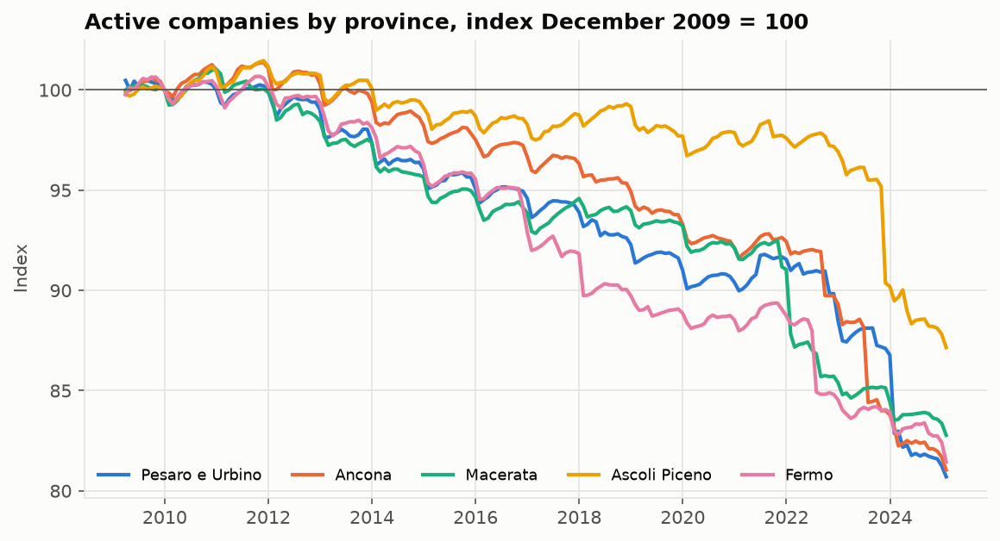
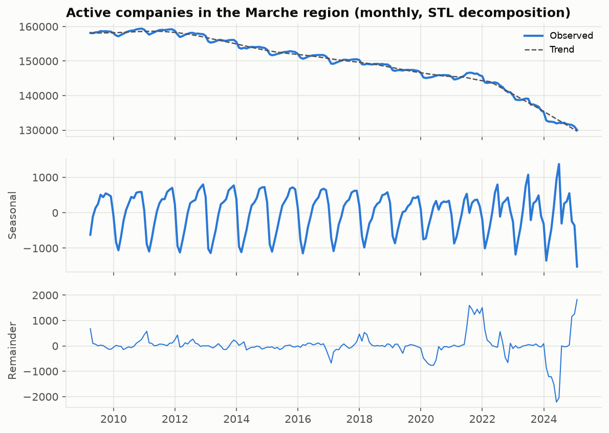
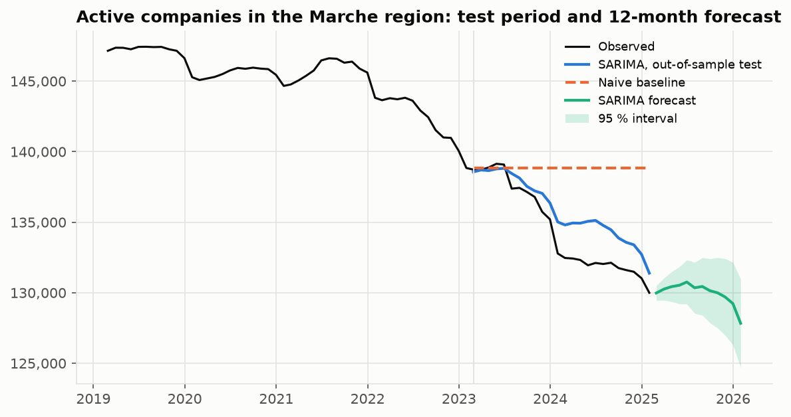
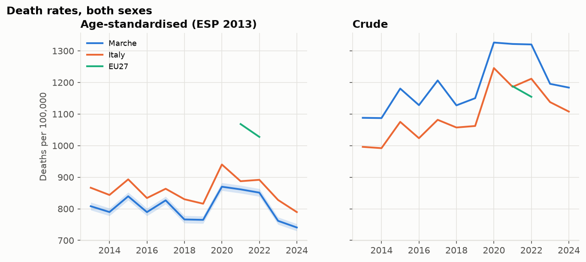
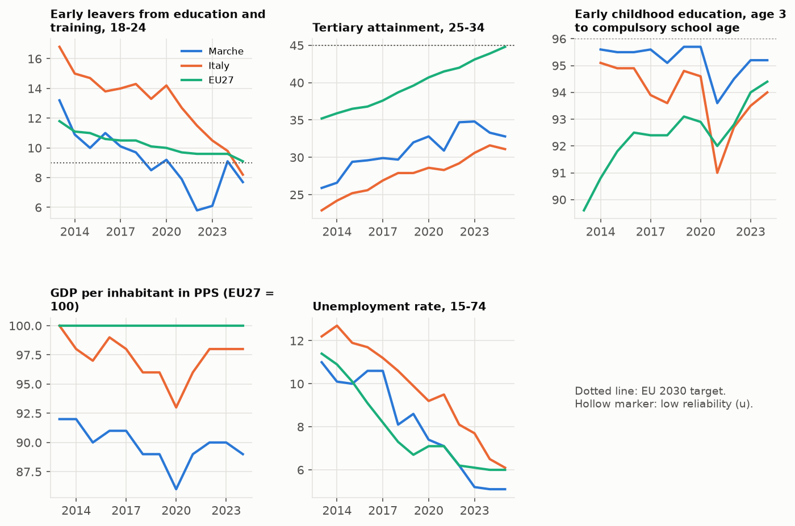
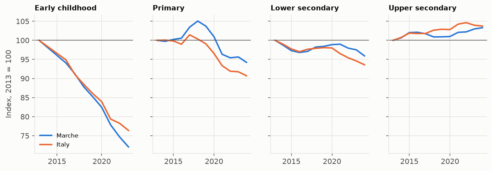

# Results

Generated 2026-10-09 by `marche-stats run`. Methods and caveats: [methodology note](methodology.md).

## 1. Source data checks (active companies file)

| Check | Result | Detail |
|---|---|---|
| Unique territory and sector | pass | 0 duplicated rows |
| Known province codes | pass | unknown: none |
| Counts are non-negative integers | pass | 0 missing values |
| TOTAL row equals the sum of sections | pass | 0 territories differ in at least one month |
| No missing months | pass | 193 months from 2009-03 to 2025-03 |
| No month identical to the previous one | FAIL | identical: 28/02/2025; regional total unchanged in 1 month(s) |
| Municipalities merged inside the region (no correction needed) | pass | 18 territories fall to zero and are absorbed by a successor |
| Municipalities transferred to another region (removed from all months) | pass | 9 territories, 2,184 active companies in 31/03/2009 |

Months identical to the previous one in every cell are treated as not updated: 2025-02. The time series stops before the first of them, because SARIMA needs consecutive months, so it runs from 2009-03 to 2025-01 (191 months) and later months in the file are not used.

## 2. Provinces (NUTS 3)

| NUTS 3 | Province | Active companies per 1,000 residents, Dec 2024 | Change in active companies, 2009-2024 (%) | Population change, 2010-2025 (%) | Residents aged 65+, 1 Jan 2025 (%) | Crude death rate per 1,000, 2024 |
|---|---|---|---|---|---|---|
| ITI31 | Pesaro e Urbino | 87.0 | -18.8 | -3.9 | 25.7 | 11.1 |
| ITI32 | Ancona | 74.4 | -18.3 | -2.7 | 26.5 | 11.6 |
| ITI33 | Macerata | 101.7 | -16.6 | -5.9 | 26.9 | 12.6 |
| ITI34 | Ascoli Piceno | 93.1 | -12.2 | -5.4 | 27.4 | 12.2 |
| ITI35 | Fermo | 101.1 | -17.6 | -4.9 | 27.3 | 12.2 |

## 3. Seasonality

Seasonal strength (STL, 0 = none, 1 = purely seasonal): **0.56**. Average seasonal effect by calendar month, in number of active companies:

| Jan | Feb | Mar | Apr | May | Jun | Jul | Aug | Sep | Oct | Nov | Dec |
|---|---|---|---|---|---|---|---|---|---|---|---|
| -936 | -967 | -616 | -227 | +153 | +399 | +195 | +347 | +504 | +560 | +453 | +71 |

## 4. SARIMA model

Specification chosen by AIC on the training period (up to 2023-01): SARIMA(2, 1, 2)(0, 1, 1)[12], AIC 1,903.2.

Out-of-sample errors over the last 24 months (2023-02 to 2025-01), forecasting from the end of the training period without updating:

| Method | MAE | MAPE (%) |
|---|---|---|
| SARIMA | 1,503.68 | 1.13 |
| Naive (last value) | 4,377.62 | 3.31 |
| Seasonal naive | 7,684.79 | 5.76 |

Share of test months inside the SARIMA 95 % prediction interval: **100 %** (nominal 95 %).

12-month forecast, refitted on the full series:

| Month | forecast | lower_95 | upper_95 |
|---|---|---|---|
| 2025-02 | 129,982 | 129,460 | 130,505 |
| 2025-03 | 130,262 | 129,470 | 131,053 |
| 2025-04 | 130,432 | 129,370 | 131,494 |
| 2025-05 | 130,529 | 129,216 | 131,842 |
| 2025-06 | 130,761 | 129,197 | 132,325 |
| 2025-07 | 130,351 | 128,546 | 132,155 |
| 2025-08 | 130,444 | 128,402 | 132,486 |
| 2025-09 | 130,145 | 127,873 | 132,417 |
| 2025-10 | 129,994 | 127,497 | 132,490 |
| 2025-11 | 129,701 | 126,986 | 132,415 |
| 2025-12 | 129,235 | 126,308 | 132,161 |
| 2026-01 | 127,833 | 124,700 | 130,965 |

## 5. Mortality (age-standardised)

Death rates per 100,000 in 2024, both sexes. Standardised rates use the European Standard Population 2013 with an open 85+ group and a Dobson 95 % interval.

| Area | Crude | Standardised | 95 % low | 95 % high |
|---|---|---|---|---|
| Marche | 1,183.8 | 740.9 | 729.6 | 752.2 |
| Emilia-Romagna | 1,136.2 | 760.7 | 753.9 | 767.5 |
| Toscana | 1,214.5 | 760.2 | 752.9 | 767.5 |
| Umbria | 1,243.4 | 755.9 | 741.1 | 770.9 |
| Lazio | 1,069.6 | 794.8 | 788.4 | 801.2 |
| Abruzzo | 1,171.5 | 790.8 | 778.0 | 803.9 |
| Italy | 1,107.8 | 789.6 | 787.7 | 791.6 |

No complete 2024 data (deaths and population in every age group) for: European Union (27).

Complete deaths and population by age group: European Union (27) only in 2021, 2022.

Pooled five-year rate, 2020-2024 (the latest five years with complete data for the six regions and Italy):

| Area | Standardised, 2020-2024 | 95 % low | 95 % high |
|---|---|---|---|
| Marche | 816.3 | 811.0 | 821.7 |
| Emilia-Romagna | 835.2 | 832.0 | 838.4 |
| Toscana | 817.4 | 814.0 | 820.8 |
| Umbria | 807.1 | 800.2 | 814.0 |
| Lazio | 848.7 | 845.7 | 851.7 |
| Abruzzo | 862.3 | 856.2 | 868.4 |
| Italy | 866.4 | 865.4 | 867.3 |

Left out for lack of complete data in 2020-2024: European Union (27).

Check against Eurostat's published standardised rate for the Marche:

| Year | This project | Eurostat (hlth_cd_asdr2) | Difference (%) |
|---|---|---|---|
| 2018 | 766.29 | 767.95 | -0.22 |
| 2019 | 765.00 | 767.15 | -0.28 |
| 2020 | 869.89 | 873.21 | -0.38 |
| 2021 | 861.50 | 864.86 | -0.39 |

Deaths of unknown age, Marche: at most 0.00 % of the yearly total, redistributed in proportion to the known ages.

## 6. Education

Latest value of each indicator, both sexes. Gaps are in percentage points; rank 1 is the best of the six regions; distance to the EU 2030 target is positive when the target is met.

| Indicator | Year | Marche | Italy | EU27 | Gap vs Italy | Gap vs EU27 | Rank | Change since | Change | Distance to EU target |
|---|---|---|---|---|---|---|---|---|---|---|
| Early leavers from education and training, 18-24 | 2025 | 7.7 | 8.2 | 9.1 | -0.5 | -1.4 | 5 of 6 | 2013 | -5.5 | 1.3 |
| Tertiary attainment, 25-34 | 2025 | 32.8 | 31.1 | 44.8 | 1.7 | -12.0 | 4 of 6 | 2013 | 6.9 | -12.2 |
| Early childhood education, age 3 to compulsory school age | 2024 | 95.2 | 94.0 | 94.4 | 1.2 | 0.8 | 3 of 6 | 2014 | -0.4 | -0.8 |

Enrolment against Italy (the EU27 aggregate is incomplete in this dataset):

## 7. Economy

GDP per inhabitant in PPS compares areas within a year, not growth over time.

| Indicator | Year | Marche | Italy | EU27 | Gap vs Italy | Gap vs EU27 | Rank | Change since | Change |
|---|---|---|---|---|---|---|---|---|---|
| GDP per inhabitant in PPS (EU27 = 100) | 2024 | 89.0 | 98.0 | 100.0 | -9.0 | -11.0 | 4 of 6 | 2013 | -3.0 |
| Unemployment rate, 15-74 | 2025 | 5.1 | 6.1 | 6.0 | -1.0 | -0.9 | 4 of 6 | 2013 | -5.9 |
