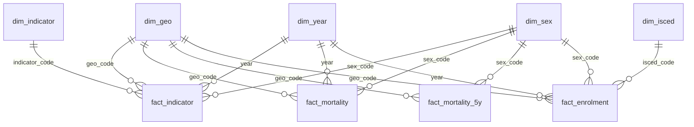

# marche-regional-stats v0.2 Implementation Plan

> **For agentic workers:** REQUIRED SUB-SKILL: Use superpowers:subagent-driven-development (recommended) or superpowers:executing-plans to implement this plan task-by-task. Steps use checkbox (`- [ ]`) syntax for tracking. Part C (learning sessions) is not agent work: the author does it with Claude as tutor.

**Goal:** Bring the v0.1 Power BI content into the reproducible Python pipeline with sound method (ESP 2013 standardisation, EU 2030 indicators, PPS, one unemployment source), write a star schema to `data/model/`, and scaffold a `.pbip` project on it, whose measures the author writes in guided learning sessions.

**Architecture:** `marche-stats download` fetches nine more Eurostat datasets for eight areas and checks their coverage. New modules compute mortality, indicators and comparisons. `marche-stats report` appends three sections to `docs/results.md`, and `marche-stats model` writes nine CSV tables to `data/model/`, which are committed. The Power BI semantic model in TMDL reads those CSVs; Claude writes its tables, Power Query and relationships, and the author writes every DAX measure and the calculation group.

**Tech Stack:** Python 3.11, pandas 3, scipy, matplotlib, requests, pytest, ruff; Eurostat SDMX 2.1 API; Power BI Desktop (2025 or later) with PBIP, TMDL and PBIR.

**Spec:** `docs/superpowers/specs/2026-10-09-marche-v0.2-design.md`

## Global Constraints

- Branch `v0.2`. Commit messages follow the repository style: `type: lower-case summary` (`feat:`, `test:`, `docs:`, `ci:`, `chore:`, `data:`).
- Python 3.11 as in CI. No new dependencies: `requirements.txt` stays as it is.
- `ruff check src tests` and `ruff format --check src tests` must pass (line length 100, rules E, F, I, B, UP). Run `ruff format src tests` before each commit.
- The package is installed in editable mode. If you work in a separate worktree, run `pip install -e .` there first, or the tests import the other checkout.
- Code, comments, docs and commit messages in English.
- Tests run on synthetic data only. `data/raw/` is never committed; `data/model/` is committed.
- Areas: `ITI3` Marche (focus), `ITH5`, `ITI1`, `ITI2`, `ITI4`, `ITF1` (neighbours), `IT`, `EU27_2020` (benchmarks). Regional data from 2013.
- ESP 2013 weights with 85–89, 90–94 and 95+ merged into 85+ = 2,500. Rates per 100,000. Dobson 95 % intervals.
- The Marche standardised rate (both sexes) must stay within 3 % of Eurostat's `hlth_cd_asdr2` in every year both exist.
- Model CSVs: UTF-8, `.` as decimal separator, `\n` line endings, columns in contract order, rows sorted by key, fixed rounding.
- Power BI: every Power Query partition parses with culture `en-US`; implicit measures off; relationships one-to-many, single direction.
- **Claude never writes DAX measures or the calculation group into the TMDL.** The author writes them (Part C). Claude explains, asks, and reviews.

## Review Focus

Inputs the spec implies that are most likely to bite, and the test that pins each one:

1. Eurostat answers an oversized or malformed query with an XML error and HTTP 200 (seen on 2026-10-09 with `EXTRACTION_TOO_BIG`): the download must stop with a `DownloadError` naming the dataset, not fail later in parsing. Pinned by `test_xml_error_body_is_reported_not_parsed` (Task 1).
2. An EU27 aggregate with missing age groups (the real data lack 30–34 and 45–49 on 1 January 2024): no standardised rate on a partial age range, the area left out of the five-year table and named in the results. Pinned by `test_key_missing_an_age_group_is_dropped`, `test_area_missing_an_age_group_in_the_window_is_left_out` (Task 2) and the report test (Task 5).
3. A comparison area without a value in the Marche's latest year: the results must show a dash, never `nan`. Pinned by `test_table_formats_floats_and_shows_missing_values_as_a_dash` (Task 5).
4. Power BI with Italian regional settings would read `7.7` as `77`: every partition must parse with `en-US`. Pinned by `test_every_partition_parses_csv_with_en_us_culture` (Task 8).
5. `ModelSource` pointing at GitHub `main` while the tables exist only on branch `v0.2`: refresh fails with a 404. Not testable in CI; session B1 sets the parameter to the local folder first and checks one value.

## File structure

| File | Status | Responsibility |
|---|---|---|
| `src/marche_stats/eurostat.py` | modify | Dataset registries, SDMX download with format check, `read_sdmx`, `check_coverage` |
| `src/marche_stats/mortality.py` | create | ESP 2013 rates, Dobson intervals, five-year pooled rate, Eurostat benchmark |
| `src/marche_stats/indicators.py` | create | Indicator registry, long-format loading, comparisons |
| `src/marche_stats/education.py` | create | Enrolment by ISCED level, enrolment index, education indicators |
| `src/marche_stats/economy.py` | create | Economy indicators |
| `src/marche_stats/model.py` | create | Star schema: build, write, read, contract check |
| `src/marche_stats/markdown.py` | create | Markdown table helper (moved from `report.py`) |
| `src/marche_stats/regional_report.py` | create | Sections 5–7 of `docs/results.md` |
| `src/marche_stats/figures.py` | modify | Three new figures |
| `src/marche_stats/report.py` | modify | Uses `markdown.table`, appends the regional sections |
| `src/marche_stats/cli.py` | modify | `model` step |
| `tests/regional_fixtures.py` | create | Synthetic SDMX-CSV extracts for the nine datasets |
| `tests/conftest.py` | modify | `eurostat_dir` fixture |
| `tests/test_eurostat.py`, `test_mortality.py`, `test_indicators.py`, `test_model.py`, `test_markdown.py`, `test_committed_model.py`, `test_powerbi.py` | create | Tests |
| `tests/test_analysis.py` | modify | End-to-end report test on the new fixture |
| `data/model/*.csv` | create | Model tables (generated, committed) |
| `.gitignore` | modify | Ignore `data/raw/` only; ignore Power BI local files |
| `.github/workflows/refresh.yml` | create | Manual refresh and drift check |
| `docs/methodology.md`, `README.md`, `powerbi/README.md`, `powerbi/sources.md` | modify | Documentation |
| `docs/powerbi-checks.md` | create | DAX against Python cross-check |
| `powerbi/marche-regional-stats.pbip` and its two folders | create | Power BI project |

## Order of work

| Step | Who | What |
|---|---|---|
| Tasks 1–2 | Claude | Downloads, coverage, mortality |
| Session A1 | Author + Claude | Age standardisation |
| Tasks 3–7 | Claude | Indicators, model, report, real data, docs |
| Session A2 | Author + Claude | Uncertainty and reliability |
| Task 8 | Author, then Claude | Empty PBIP, then TMDL scaffolding |
| Sessions B1–B6 | Author + Claude | Model, measures, calculation group, pages, exports |
| Task 9 | Claude, then author | Cross-check document and Power BI docs |
| Session C1 | Author + Claude | Mock technical interview |
| Task 10 | Claude | Release v0.2.0 |

---

# Part A — Python pipeline (Claude)

### Task 1: Regional downloads, SDMX reader and coverage check

**Files:**
- Modify: `src/marche_stats/eurostat.py` (full replacement below; the v0.1 functions `read_sdmx_csv` and `demography` are unchanged)
- Create: `tests/regional_fixtures.py`
- Modify: `tests/conftest.py`
- Test: `tests/test_eurostat.py`

**Interfaces:**
- Consumes: nothing new.
- Produces:
  - `eurostat.FOCUS_GEO = "ITI3"`, `eurostat.COMPARISON_GEOS: tuple[str, ...]` (8 codes, order above), `eurostat.REGIONS` (first 6), `eurostat.GEO_NAMES: dict[str, str]`, `eurostat.REGIONAL_START = 2013`
  - `eurostat.REGIONAL_DATASETS: dict[str, tuple[str, str]]` (raw file name → dataset code, key without geo)
  - `eurostat.KNOWN_GAPS: set[tuple[str, str, int]]`
  - `eurostat.read_sdmx(path: Path) -> pd.DataFrame`: every dimension column, then `geo`, `year` (int), `value` (float, NaN when missing), `flag` (str, `""` when none)
  - `eurostat.check_coverage(frame: pd.DataFrame, filename: str) -> None`, raises `eurostat.CoverageError`
  - `eurostat.DownloadError`, `eurostat.dataset_url(code, key, start_period, geos=GEOS) -> str`
  - Test helpers: `regional_fixtures.write_regional_fixtures(directory: Path) -> None`, `regional_fixtures.DEATH_RATES`, `regional_fixtures.BASE`, `regional_fixtures.expected_std_rate() -> float`; pytest fixture `eurostat_dir` (a folder with the v0.1 fixtures plus the nine synthetic files)

- [ ] **Step 1: Create the synthetic fixtures**

`tests/regional_fixtures.py`:

```python
"""Synthetic Eurostat extracts for the eight comparison geographies, in SDMX-CSV layout.

Values are invented but consistent, so tests can work out expected results by hand:
- population is constant over time: 5,000 x scale per sex and five-year age group;
- deaths follow fixed age-specific rates (DEATH_RATES), all recorded at the first single
  year of each age group, with T = M + F;
- EU27 deaths stop in 2023 and EU27 enrolment skips 2017, as at the source.
"""

from __future__ import annotations

from pathlib import Path

import pandas as pd

from marche_stats.eurostat import COMPARISON_GEOS

# Kept independent of marche_stats.mortality, so the tests check the code against its own
# copy of the standard: Eurostat age group codes and ESP 2013 weights, 85+ merged.
AGE_GROUPS = ["Y_LT5", *[f"Y{a}-{a + 4}" for a in range(5, 85, 5)], "Y_GE85"]
ESP_2013 = dict(
    zip(
        AGE_GROUPS,
        [5000, 5500, 5500, 5500, 6000, 6000, 6500, 7000, 7000]
        + [7000, 7000, 6500, 6000, 5500, 5000, 4000, 2500, 2500],
        strict=True,
    )
)
YEARS = range(2013, 2025)
POPULATION_YEARS = range(2013, 2026)
SCALE = {
    "ITI3": 1.0,
    "ITH5": 3.0,
    "ITI1": 2.5,
    "ITI2": 0.6,
    "ITI4": 3.8,
    "ITF1": 0.9,
    "IT": 39.0,
    "EU27_2020": 300.0,
}
# Annual deaths per person, by five-year age group: 0.0005 at 0-4, rising 30 % per group.
DEATH_RATES = {group: 0.0005 * 1.3**i for i, group in enumerate(AGE_GROUPS)}
PER_SEX = 5_000
FIRST_AGE = {
    group: ("Y_LT1" if group == "Y_LT5" else f"Y{5 * i}") for i, group in enumerate(AGE_GROUPS)
}
SINGLE_AGES = ["Y_LT1", *[f"Y{age}" for age in range(1, 100)], "Y_OPEN"]
# Indicator base values by geography; each indicator adds a per-year drift.
BASE = {
    "ITI3": 10.0,
    "ITH5": 9.0,
    "ITI1": 11.0,
    "ITI2": 8.0,
    "ITI4": 12.0,
    "ITF1": 13.0,
    "IT": 12.5,
    "EU27_2020": 10.5,
}


def expected_std_rate() -> float:
    """ESP 2013 rate per 100,000 implied by DEATH_RATES, before rounding of deaths."""
    return sum(ESP_2013[group] * rate for group, rate in DEATH_RATES.items())


def _write(path: Path, code: str, dims: list[str], rows: list[tuple]) -> None:
    """rows: (*dimension values, geo, year, value, flag)."""
    columns = ["DATAFLOW", "LAST UPDATE", "freq", *dims, "geo"]
    columns += ["TIME_PERIOD", "OBS_VALUE", "OBS_FLAG", "CONF_STATUS"]
    data = [[f"ESTAT:{code.upper()}(1.0)", "01/10/26 23:00:00", "A", *row, ""] for row in rows]
    pd.DataFrame(data, columns=columns).to_csv(path, index=False)


def _deaths_rows() -> list[tuple]:
    rows = []
    for geo in COMPARISON_GEOS:
        for year in YEARS:
            if geo == "EU27_2020" and year == 2024:
                continue
            by_sex = {}
            for sex in ("M", "F"):
                by_sex[sex] = {
                    FIRST_AGE[g]: round(DEATH_RATES[g] * PER_SEX * SCALE[geo]) for g in AGE_GROUPS
                }
            by_sex["T"] = {age: by_sex["M"][age] + by_sex["F"][age] for age in by_sex["M"]}
            for sex, deaths in by_sex.items():
                for age in SINGLE_AGES:
                    rows.append(("NR", sex, age, geo, year, deaths.get(age, 0), ""))
                rows.append(("NR", sex, "TOTAL", geo, year, sum(deaths.values()), ""))
                rows.append(("NR", sex, "UNK", geo, year, 0, ""))
    return rows


def _population_rows() -> list[tuple]:
    rows = []
    for geo in COMPARISON_GEOS:
        for year in POPULATION_YEARS:
            for sex, factor in (("M", 1), ("F", 1), ("T", 2)):
                group_pop = PER_SEX * SCALE[geo] * factor
                for group in AGE_GROUPS:
                    rows.append(("NR", sex, group, geo, year, group_pop, ""))
                # Overlapping open groups and totals, as in the real extract: must be ignored.
                for extra, groups in (("Y_GE75", 3), ("Y_GE80", 2), ("TOTAL", len(AGE_GROUPS))):
                    rows.append(("NR", sex, extra, geo, year, group_pop * groups, ""))
                rows.append(("NR", sex, "UNK", geo, year, 0, ""))
    return rows


def _indicator_rows(dims_before: tuple, dims_after: tuple, base_shift: float, years) -> list:
    """Rows for a rate indicator by sex: T = base + 0.1 per year, M = T + 0.5, F = T - 0.5."""
    rows = []
    for geo in COMPARISON_GEOS:
        for year in years:
            total = BASE[geo] + base_shift + 0.1 * (year - 2013)
            for sex, value in (("T", total), ("M", total + 0.5), ("F", total - 0.5)):
                flag = "u" if (geo == "ITI3" and sex == "F" and year == 2024) else ""
                rows.append((*dims_before, sex, *dims_after, geo, year, round(value, 1), flag))
    return rows


def write_regional_fixtures(directory: Path) -> None:
    """Write the nine v0.2 raw files into `directory`."""
    _write(
        directory / "regional_deaths.csv",
        "demo_r_magec",
        ["unit", "sex", "age"],
        _deaths_rows(),
    )
    _write(
        directory / "regional_population.csv",
        "demo_r_pjangroup",
        ["unit", "sex", "age"],
        _population_rows(),
    )
    benchmark = [
        ("RT", sex, "TOTAL", "A-R_V-Y", geo, year, round(1.01 * expected_std_rate(), 2), "")
        for geo in COMPARISON_GEOS
        for year in range(2018, 2022)
        for sex in ("T", "M", "F")
    ]
    _write(
        directory / "death_rate_benchmark.csv",
        "hlth_cd_asdr2",
        ["unit", "sex", "age", "icd10"],
        benchmark,
    )
    enrolment = []
    for geo in COMPARISON_GEOS:
        for year in YEARS:
            if geo == "EU27_2020" and year == 2017:
                continue
            for level in range(9):
                males = round(1000 * SCALE[geo] * (9 - level) * 0.99 ** (year - 2013))
                flag = "d" if (geo == "ITI3" and level == 3 and year == 2016) else ""
                for sex, value in (("M", males), ("F", males), ("T", 2 * males)):
                    enrolment.append(("NR", f"ED{level}", sex, geo, year, value, flag))
            enrolment.append(("NR", "ED0-8", "T", geo, year, 0, ""))  # aggregate: ignored
    _write(directory / "enrolment.csv", "educ_uoe_enra11", ["unit", "isced11", "sex"], enrolment)
    _write(
        directory / "early_leavers.csv",
        "edat_lfse_16",
        ["unit", "sex", "age"],
        _indicator_rows(("PC",), ("Y18-24",), 0.0, YEARS),
    )
    _write(
        directory / "tertiary_attainment.csv",
        "edat_lfse_04",
        ["sex", "isced11", "age", "unit"],
        _indicator_rows((), ("ED5-8", "Y25-34", "PC"), 20.0, YEARS),
    )
    early_childhood = [
        ("PC", geo, year, round(90 + BASE[geo] / 4 + 0.1 * (year - 2014), 1), "")
        for geo in COMPARISON_GEOS
        for year in range(2014 if geo != "EU27_2020" else 2013, 2025)
    ]
    _write(directory / "early_childhood.csv", "educ_uoe_enra22", ["unit"], early_childhood)
    gdp = [
        ("PPS_HAB_EU27_2020", geo, year, 100 if geo == "EU27_2020" else 80 + 2 * BASE[geo], "")
        for geo in COMPARISON_GEOS
        for year in YEARS
    ]
    _write(directory / "gdp.csv", "nama_10r_2gdp", ["unit"], gdp)
    _write(
        directory / "unemployment.csv",
        "lfst_r_lfu3rt",
        ["isced11", "sex", "age", "unit"],
        _indicator_rows(("TOTAL",), ("Y15-74", "PC"), -2.0, YEARS),
    )
```

- [ ] **Step 2: Add the `eurostat_dir` fixture to `tests/conftest.py`**

Add `import shutil` to the standard-library imports, `from regional_fixtures import write_regional_fixtures` after `import pytest`, and append:

```python
@pytest.fixture
def eurostat_dir(tmp_path: Path) -> Path:
    """The v0.1 Eurostat fixtures plus synthetic v0.2 regional extracts."""
    directory = tmp_path / "raw"
    directory.mkdir()
    for path in FIXTURES.iterdir():
        shutil.copy(path, directory / path.name)
    write_regional_fixtures(directory)
    return directory
```

- [ ] **Step 3: Write the failing tests**

`tests/test_eurostat.py`:

```python
import pytest
import requests

from marche_stats import eurostat


def test_read_sdmx_keeps_dimensions_flags_and_missing_values(tmp_path):
    path = tmp_path / "x.csv"
    path.write_text(
        "DATAFLOW,LAST UPDATE,freq,unit,sex,geo,TIME_PERIOD,OBS_VALUE,OBS_FLAG,CONF_STATUS\n"
        "ESTAT:X(1.0),01/10/26,A,PC,T,ITI3,2024,7.7,u,\n"
        "ESTAT:X(1.0),01/10/26,A,PC,T,ITI3,2025,:,,\n"
        "ESTAT:X(1.0),01/10/26,A,PC,T,NA,2025,1.0,,\n"
    )
    frame = eurostat.read_sdmx(path)
    assert list(frame.columns) == ["unit", "sex", "geo", "year", "value", "flag"]
    assert frame["year"].tolist() == [2024, 2025, 2025]
    assert frame["value"].iloc[0] == 7.7
    assert frame["value"].isna().tolist() == [False, True, False]
    assert frame["flag"].tolist() == ["u", "", ""]
    assert frame["geo"].iloc[2] == "NA"  # a geo code, not a missing value


def test_regional_url_puts_every_comparison_geo_last():
    url = eurostat.dataset_url("gdp", "A.PPS_HAB_EU27_2020", 2013, eurostat.COMPARISON_GEOS)
    assert "/data/gdp/A.PPS_HAB_EU27_2020.ITI3+ITH5+ITI1+ITI2+ITI4+ITF1+IT+EU27_2020?" in url
    assert url.endswith("startPeriod=2013")


def test_synthetic_extracts_pass_the_coverage_check(eurostat_dir):
    for filename in eurostat.REGIONAL_DATASETS:
        eurostat.check_coverage(eurostat.read_sdmx(eurostat_dir / filename), filename)


def test_missing_geography_is_named(eurostat_dir):
    frame = eurostat.read_sdmx(eurostat_dir / "gdp.csv")
    frame = frame[~((frame["geo"] == "ITI2") & (frame["year"] == 2020))]
    with pytest.raises(eurostat.CoverageError, match="gdp.csv: missing ITI2 2020"):
        eurostat.check_coverage(frame, "gdp.csv")


def test_missing_value_counts_as_a_gap(eurostat_dir):
    frame = eurostat.read_sdmx(eurostat_dir / "gdp.csv")
    frame.loc[(frame["geo"] == "IT") & (frame["year"] == 2015), "value"] = float("nan")
    with pytest.raises(eurostat.CoverageError, match="IT 2015"):
        eurostat.check_coverage(frame, "gdp.csv")


def test_known_gap_is_allowed_only_for_its_file(eurostat_dir):
    deaths = eurostat.read_sdmx(eurostat_dir / "regional_deaths.csv")
    assert not ((deaths["geo"] == "EU27_2020") & (deaths["year"] == 2024)).any()
    eurostat.check_coverage(deaths, "regional_deaths.csv")
    with pytest.raises(eurostat.CoverageError, match="EU27_2020 2024"):
        eurostat.check_coverage(deaths, "gdp.csv")


def test_no_focus_data_is_an_error(eurostat_dir):
    frame = eurostat.read_sdmx(eurostat_dir / "gdp.csv")
    with pytest.raises(eurostat.CoverageError, match="no data for ITI3"):
        eurostat.check_coverage(frame[frame["geo"] != "ITI3"], "gdp.csv")


def test_http_error_names_dataset_and_url(monkeypatch, tmp_path):
    class Failing:
        def raise_for_status(self):
            raise requests.HTTPError("503 Service Unavailable")

    monkeypatch.setattr(eurostat.requests, "get", lambda url, timeout: Failing())
    with pytest.raises(
        eurostat.DownloadError, match=r"demo_r_pjanaggr3: download failed from https://"
    ):
        eurostat.download(tmp_path)


def test_xml_error_body_is_reported_not_parsed(monkeypatch, tmp_path):
    class XmlFault:
        content = b'<?xml version="1.0"?><S:Fault><faultstring>EXTRACTION_TOO_BIG</faultstring>'

        def raise_for_status(self):
            pass

    monkeypatch.setattr(eurostat.requests, "get", lambda url, timeout: XmlFault())
    with pytest.raises(eurostat.DownloadError, match="expected SDMX-CSV.*EXTRACTION_TOO_BIG"):
        eurostat.download(tmp_path)
```

- [ ] **Step 4: Run the tests to see them fail**

Run: `pytest -q`
Expected: `ImportError while loading conftest`, caused by `cannot import name 'COMPARISON_GEOS' from 'marche_stats.eurostat'` (raised by `tests/regional_fixtures.py`).

- [ ] **Step 5: Replace `src/marche_stats/eurostat.py`**

```python
"""Eurostat data for the Marche provinces and regional comparisons, and GISCO boundaries."""

from __future__ import annotations

import io
import json
from pathlib import Path

import pandas as pd
import requests

SDMX_BASE = "https://ec.europa.eu/eurostat/api/dissemination/sdmx/2.1"
GISCO_NUTS3_URL = (
    "https://gisco-services.ec.europa.eu/distribution/v2/nuts/geojson/"
    "NUTS_RG_03M_2024_4326_LEVL_3.geojson"
)
TIMEOUT_SECONDS = 180

# Marche NUTS 3 regions, the region (NUTS 2) and Italy.
GEOS = ("ITI31", "ITI32", "ITI33", "ITI34", "ITI35", "ITI3", "IT")
NUTS3_NAMES = {
    "ITI31": "Pesaro e Urbino",
    "ITI32": "Ancona",
    "ITI33": "Macerata",
    "ITI34": "Ascoli Piceno",
    "ITI35": "Fermo",
}

# File name -> (dataset, SDMX series key without geo). Keys follow each dataset's DSD order.
DATASETS = {
    "population.csv": ("demo_r_pjanaggr3", "A.NR.T.TOTAL+Y_GE65"),
    "deaths.csv": ("demo_r_magec3", "A.T.NR.TOTAL"),
}

# v0.2: the Marche against its neighbouring regions, Italy and the EU27.
FOCUS_GEO = "ITI3"
COMPARISON_GEOS = ("ITI3", "ITH5", "ITI1", "ITI2", "ITI4", "ITF1", "IT", "EU27_2020")
REGIONS = COMPARISON_GEOS[:6]
GEO_NAMES = {
    "ITI3": "Marche",
    "ITH5": "Emilia-Romagna",
    "ITI1": "Toscana",
    "ITI2": "Umbria",
    "ITI4": "Lazio",
    "ITF1": "Abruzzo",
    "IT": "Italy",
    "EU27_2020": "European Union (27)",
}
REGIONAL_START = 2013

# File name -> (dataset, SDMX series key without geo). Keys follow each dataset's DSD order;
# an empty position selects every code of that dimension.
REGIONAL_DATASETS = {
    "regional_deaths.csv": ("demo_r_magec", "A.NR.T+M+F."),
    "regional_population.csv": ("demo_r_pjangroup", "A.NR.T+M+F."),
    "death_rate_benchmark.csv": ("hlth_cd_asdr2", "A.RT.T+M+F.TOTAL.A-R_V-Y"),
    "enrolment.csv": ("educ_uoe_enra11", "A.NR..T+M+F"),
    "early_leavers.csv": ("edat_lfse_16", "A.PC.T+M+F.Y18-24"),
    "tertiary_attainment.csv": ("edat_lfse_04", "A.T+M+F.ED5-8.Y25-34.PC"),
    "early_childhood.csv": ("educ_uoe_enra22", "A.PC"),
    "gdp.csv": ("nama_10r_2gdp", "A.PPS_HAB_EU27_2020"),
    "unemployment.csv": ("lfst_r_lfu3rt", "A.TOTAL.T+M+F.Y15-74.PC"),
}

# (file name, geo, year) combinations missing at the source, checked on 2026-10-09.
KNOWN_GAPS = {
    ("regional_deaths.csv", "EU27_2020", 2024),
    ("enrolment.csv", "EU27_2020", 2017),
}

METADATA_COLUMNS = ("DATAFLOW", "LAST UPDATE", "freq", "CONF_STATUS")


class DownloadError(RuntimeError):
    """A request to Eurostat or GISCO failed."""


class CoverageError(ValueError):
    """A downloaded dataset lacks a geography or year that the analysis needs."""


def dataset_url(code: str, key: str, start_period: int, geos: tuple[str, ...] = GEOS) -> str:
    return (
        f"{SDMX_BASE}/data/{code}/{key}.{'+'.join(geos)}?format=SDMX-CSV&startPeriod={start_period}"
    )


def _fetch(url: str, label: str) -> requests.Response:
    try:
        response = requests.get(url, timeout=TIMEOUT_SECONDS)
        response.raise_for_status()
    except requests.RequestException as error:
        raise DownloadError(f"{label}: download failed from {url} ({error})") from error
    return response


def _fetch_sdmx(url: str, code: str) -> bytes:
    """SDMX-CSV body; Eurostat reports some errors (e.g. EXTRACTION_TOO_BIG) as XML with 200."""
    content = _fetch(url, code).content
    if not content.startswith(b"DATAFLOW"):
        snippet = content[:200].decode("utf-8", errors="replace")
        raise DownloadError(f"{code}: expected SDMX-CSV from {url}, got: {snippet}")
    return content


def download(raw_dir: Path, start_period: int = 2009) -> None:
    raw_dir.mkdir(parents=True, exist_ok=True)
    for filename, (code, key) in DATASETS.items():
        content = _fetch_sdmx(dataset_url(code, key, start_period), code)
        (raw_dir / filename).write_bytes(content)

    for filename, (code, key) in REGIONAL_DATASETS.items():
        url = dataset_url(code, key, REGIONAL_START, COMPARISON_GEOS)
        (raw_dir / filename).write_bytes(_fetch_sdmx(url, code))
        check_coverage(read_sdmx(raw_dir / filename), filename)

    response = _fetch(GISCO_NUTS3_URL, "GISCO NUTS 3")
    features = [f for f in response.json()["features"] if f["properties"]["NUTS_ID"] in NUTS3_NAMES]
    (raw_dir / "marche_nuts3.geojson").write_text(
        json.dumps({"type": "FeatureCollection", "features": features}), encoding="utf-8"
    )


def read_sdmx(path: Path) -> pd.DataFrame:
    """Every dimension column, plus year, value (NaN when missing) and flag ('' when none)."""
    frame = pd.read_csv(path, dtype=str, keep_default_na=False)
    frame = frame.drop(columns=[c for c in METADATA_COLUMNS if c in frame.columns])
    frame = frame.rename(columns={"TIME_PERIOD": "year", "OBS_VALUE": "value", "OBS_FLAG": "flag"})
    frame["year"] = frame["year"].astype(int)
    frame["value"] = pd.to_numeric(frame["value"].where(~frame["value"].isin(["", ":"])))
    frame["flag"] = frame["flag"].astype(str).str.strip()
    return frame


def check_coverage(frame: pd.DataFrame, filename: str) -> None:
    """Every comparison geography must have every year the focus region has, bar KNOWN_GAPS."""
    observed = frame.dropna(subset=["value"])
    present = set(zip(observed["geo"], observed["year"], strict=True))
    focus_years = sorted({year for geo, year in present if geo == FOCUS_GEO})
    if not focus_years:
        raise CoverageError(f"{filename}: no data for {FOCUS_GEO}")
    missing = [
        (geo, year)
        for geo in COMPARISON_GEOS
        for year in focus_years
        if (geo, year) not in present and (filename, geo, year) not in KNOWN_GAPS
    ]
    if missing:
        listed = ", ".join(f"{geo} {year}" for geo, year in missing)
        raise CoverageError(f"{filename}: missing {listed}")


def read_sdmx_csv(path: Path) -> pd.DataFrame:
    frame = pd.read_csv(io.StringIO(path.read_text(encoding="utf-8")))
    return frame.rename(columns={"TIME_PERIOD": "year", "OBS_VALUE": "value", "OBS_FLAG": "flag"})[
        ["geo", "age", "year", "value", "flag"]
    ]


def demography(raw_dir: Path) -> pd.DataFrame:
    """One row per geo and year: population, share aged 65+, deaths, crude death rate."""
    population = read_sdmx_csv(raw_dir / "population.csv")
    deaths = read_sdmx_csv(raw_dir / "deaths.csv")

    wide = population.pivot_table(index=["geo", "year"], columns="age", values="value")
    wide = wide.rename(columns={"TOTAL": "population", "Y_GE65": "population_65_plus"})
    wide["share_65_plus"] = 100 * wide["population_65_plus"] / wide["population"]

    deaths_by_year = deaths.set_index(["geo", "year"])["value"].rename("deaths")
    out = wide.join(deaths_by_year, how="left").reset_index()
    # Crude death rate per 1,000 residents, using population on 1 January of the same year.
    out["crude_death_rate"] = 1000 * out["deaths"] / out["population"]
    return out.sort_values(["geo", "year"]).reset_index(drop=True)
```

- [ ] **Step 6: Run the tests**

Run: `pytest -q tests/test_eurostat.py tests/test_analysis.py tests/test_companies.py`
Expected: all pass (9 in `test_eurostat.py`; the v0.1 tests unchanged).

- [ ] **Step 7: Lint and commit**

```bash
ruff format src tests && ruff check src tests
git add src/marche_stats/eurostat.py tests/regional_fixtures.py tests/conftest.py tests/test_eurostat.py
git commit -m "feat: download regional Eurostat datasets with coverage and format checks"
```

---

### Task 2: Mortality — ESP 2013 rates, Dobson intervals, five-year pooled rate

**Files:**
- Create: `src/marche_stats/mortality.py`
- Test: `tests/test_mortality.py`

**Interfaces:**
- Consumes: `eurostat.read_sdmx`, `eurostat.FOCUS_GEO`, `eurostat.REGIONS`; fixture `eurostat_dir`; `regional_fixtures.DEATH_RATES`, `expected_std_rate`.
- Produces:
  - `mortality.ESP_2013: dict[str, int]`, `mortality.AGE_GROUPS: list[str]` (18 Eurostat codes, `Y_LT5` … `Y_GE85`)
  - `mortality.age_group(age: str) -> str | None`
  - `mortality.deaths_by_group(deaths) -> DataFrame[geo, sex, year, age_group, deaths]`
  - `mortality.unknown_age_share(deaths) -> DataFrame[geo, sex, year, unknown_share]`
  - `mortality.average_population(population) -> DataFrame[geo, sex, year, age_group, population]`
  - `mortality.dobson_limits(deaths, rate, variance, level=0.95) -> tuple[ndarray, ndarray]`
  - `mortality.standardise(frame, by: list[str]) -> DataFrame[*by, deaths, population, crude_rate, std_rate, ci_low, ci_high]`
  - `mortality.mortality_table(raw_dir) -> DataFrame` with `FACT_MORTALITY_COLUMNS`
  - `mortality.five_year_table(raw_dir, years=5) -> DataFrame` with `FACT_MORTALITY_5Y_COLUMNS`
  - `mortality.benchmark_differences(fact, geo="ITI3") -> DataFrame[year, std_rate, eurostat_std_rate, difference_pct]`

- [ ] **Step 1: Write the failing tests**

`tests/test_mortality.py`:

```python
import math

import numpy as np
import pandas as pd
import pytest
from regional_fixtures import DEATH_RATES, expected_std_rate
from scipy.stats import chi2

from marche_stats import mortality
from marche_stats.eurostat import COMPARISON_GEOS


def _groups(deaths: dict[str, float], population: float = 1000.0) -> pd.DataFrame:
    """One key (geo X), every age group, `population` each; deaths 0 unless given."""
    return pd.DataFrame(
        {
            "geo": "X",
            "age_group": mortality.AGE_GROUPS,
            "deaths": [deaths.get(g, 0.0) for g in mortality.AGE_GROUPS],
            "population": population,
        }
    )


def test_esp_weights_sum_to_100000_with_85_plus_merged():
    assert sum(mortality.ESP_2013.values()) == 100_000
    assert mortality.ESP_2013["Y_GE85"] == 1500 + 800 + 200
    assert len(mortality.AGE_GROUPS) == 18


@pytest.mark.parametrize(
    ("age", "group"),
    [
        ("Y_LT1", "Y_LT5"),
        ("Y4", "Y_LT5"),
        ("Y5", "Y5-9"),
        ("Y84", "Y80-84"),
        ("Y85", "Y_GE85"),
        ("Y99", "Y_GE85"),
        ("Y_OPEN", "Y_GE85"),
        ("TOTAL", None),
        ("UNK", None),
    ],
)
def test_single_years_map_to_five_year_groups(age, group):
    assert mortality.age_group(age) == group


def test_hand_computed_example_with_two_age_groups():
    # 2 deaths at 0-4 and 10 at 85+, 1,000 people in each of the 18 groups:
    # standardised = 5,000 x 2/1,000 + 2,500 x 10/1,000 = 10 + 25 = 35 per 100,000;
    # crude = 100,000 x 12 / 18,000 = 66.67 per 100,000.
    out = mortality.standardise(_groups({"Y_LT5": 2, "Y_GE85": 10}), ["geo"]).iloc[0]
    assert out["std_rate"] == pytest.approx(35.0)
    assert out["crude_rate"] == pytest.approx(66.6667, abs=1e-4)
    assert out["deaths"] == 12
    assert out["population"] == 18_000


def test_dobson_reduces_to_exact_poisson_when_deaths_sit_in_one_group():
    # Rate = 2.5 x deaths, so the interval is 2.5 x the exact Poisson interval for 10 deaths.
    out = mortality.standardise(_groups({"Y_GE85": 10}), ["geo"]).iloc[0]
    assert out["std_rate"] == pytest.approx(25.0)
    assert out["ci_low"] == pytest.approx(2.5 * chi2.ppf(0.025, 20) / 2)
    assert out["ci_high"] == pytest.approx(2.5 * chi2.ppf(0.975, 22) / 2)


def test_dobson_with_zero_deaths_starts_at_zero():
    out = mortality.standardise(_groups({}), ["geo"]).iloc[0]
    assert out["std_rate"] == 0
    assert out["ci_low"] == 0
    assert math.isnan(out["ci_high"])


def test_dobson_interval_contains_the_rate():
    rng = np.random.default_rng(1)
    for _ in range(50):
        deaths = {g: float(rng.integers(0, 200)) for g in mortality.AGE_GROUPS}
        out = mortality.standardise(_groups(deaths, 5000.0), ["geo"]).iloc[0]
        assert out["ci_low"] <= out["std_rate"] <= out["ci_high"]


def test_key_missing_an_age_group_is_dropped():
    frame = _groups({"Y_GE85": 10})
    partial = frame.assign(geo="Y").iloc[:-1]
    out = mortality.standardise(pd.concat([frame, partial]), ["geo"])
    assert out["geo"].tolist() == ["X"]


def _deaths(rows: list[tuple[str, float]]) -> pd.DataFrame:
    return pd.DataFrame(
        [("ITI3", "T", 2020, age, value) for age, value in rows],
        columns=["geo", "sex", "year", "age", "value"],
    )


def test_unknown_age_deaths_are_redistributed_and_the_total_kept():
    deaths = _deaths([("Y_LT1", 30), ("Y90", 70), ("UNK", 10), ("TOTAL", 110)])
    grouped = mortality.deaths_by_group(deaths).set_index("age_group")["deaths"]
    assert grouped.sum() == pytest.approx(110)
    assert grouped["Y_LT5"] == pytest.approx(33)
    assert grouped["Y_GE85"] == pytest.approx(77)
    share = mortality.unknown_age_share(deaths)["unknown_share"].iloc[0]
    assert share == pytest.approx(100 * 10 / 110)


def test_unknown_share_is_zero_without_unknown_rows():
    deaths = _deaths([("Y_LT1", 30), ("TOTAL", 30)])
    assert mortality.unknown_age_share(deaths)["unknown_share"].iloc[0] == 0


def test_average_population_is_the_mean_of_two_first_januaries():
    population = pd.DataFrame(
        {
            "geo": "ITI3",
            "sex": "T",
            "age": ["Y_LT5", "Y_LT5", "Y_LT5", "TOTAL"],
            "year": [2020, 2021, 2022, 2020],
            "value": [100.0, 110.0, 130.0, 999.0],
        }
    )
    out = mortality.average_population(population).set_index("year")["population"]
    assert out.to_dict() == {2020: 105.0, 2021: 120.0}  # 2022 lacks 1 January 2023


def test_mortality_table_on_synthetic_extracts(eurostat_dir):
    fact = mortality.mortality_table(eurostat_dir)
    assert list(fact.columns) == mortality.FACT_MORTALITY_COLUMNS
    assert set(fact["geo_code"]) == set(COMPARISON_GEOS)
    assert not ((fact["geo_code"] == "EU27_2020") & (fact["year"] == 2024)).any()
    marche = fact[(fact["geo_code"] == "ITI3") & (fact["sex_code"] == "T")]
    assert marche["year"].tolist() == list(range(2013, 2025))
    # Deaths are rounded to whole numbers per group, so allow 1 %.
    assert marche["std_rate"].to_numpy() == pytest.approx(expected_std_rate(), rel=0.01)
    assert marche["eurostat_std_rate"].notna().sum() == 4  # 2018-2021


def test_benchmark_differences_cover_published_years(eurostat_dir):
    table = mortality.benchmark_differences(mortality.mortality_table(eurostat_dir))
    assert table["year"].tolist() == [2018, 2019, 2020, 2021]
    assert (table["difference_pct"].abs() < 3).all()


def test_five_year_rate_is_pooled_not_averaged():
    # 85+ deaths, 1,000 then 3,000 people per group: 10 deaths in year 1 (rate 25),
    # 90 deaths in year 2 (rate 75). Pooled: 2,500 x 100 / 4,000 = 62.5; the average of the
    # two annual rates would be 50.
    rows = []
    for year, deaths, population in ((1, 10, 1000.0), (2, 90, 3000.0)):
        frame = _groups({"Y_GE85": deaths}, population).assign(year=year)
        rows.append(frame)
    frame = pd.concat(rows)
    pooled = frame.groupby(["geo", "age_group"], as_index=False)[["deaths", "population"]].sum()
    assert mortality.standardise(pooled, ["geo"])["std_rate"].iloc[0] == pytest.approx(62.5)


def test_five_year_window_follows_regions_and_italy_and_leaves_out_gaps(eurostat_dir):
    # Synthetic EU27 deaths stop in 2023: the window stays 2020-2024 and the EU27 is left
    # out instead of being pooled over four years.
    table = mortality.five_year_table(eurostat_dir)
    assert list(table.columns) == mortality.FACT_MORTALITY_5Y_COLUMNS
    assert set(table["period_start"]) == {2020}
    assert set(table["period_end"]) == {2024}
    assert "EU27_2020" not in set(table["geo_code"])
    assert len(table) == (len(COMPARISON_GEOS) - 1) * 3


def test_area_missing_an_age_group_in_the_window_is_left_out(eurostat_dir):
    path = eurostat_dir / "regional_population.csv"
    population = pd.read_csv(path, dtype=str, keep_default_na=False)
    gap = (population["geo"] == "ITF1") & (population["age"] == "Y30-34")
    gap &= population["TIME_PERIOD"] == "2022"
    population[~gap].to_csv(path, index=False)
    table = mortality.five_year_table(eurostat_dir)
    assert "ITF1" not in set(table["geo_code"])
    assert set(table["period_end"]) == {2024}


def test_synthetic_rates_rise_with_age():
    rates = list(DEATH_RATES.values())
    assert rates == sorted(rates)
```

- [ ] **Step 2: Run the tests to see them fail**

Run: `pytest -q tests/test_mortality.py`
Expected: collection error, `ImportError: cannot import name 'mortality' from 'marche_stats'`.

- [ ] **Step 3: Write `src/marche_stats/mortality.py`**

```python
"""Crude and age-standardised death rates (European Standard Population 2013)."""

from __future__ import annotations

from pathlib import Path

import numpy as np
import pandas as pd
from scipy.stats import chi2

from marche_stats.eurostat import FOCUS_GEO, REGIONS, read_sdmx

# ESP 2013 weights by Eurostat five-year age group. The population data end at the open
# group 85+, so the weights of 85-89 (1,500), 90-94 (800) and 95+ (200) are merged.
ESP_2013 = {
    "Y_LT5": 5000,
    "Y5-9": 5500,
    "Y10-14": 5500,
    "Y15-19": 5500,
    "Y20-24": 6000,
    "Y25-29": 6000,
    "Y30-34": 6500,
    "Y35-39": 7000,
    "Y40-44": 7000,
    "Y45-49": 7000,
    "Y50-54": 7000,
    "Y55-59": 6500,
    "Y60-64": 6000,
    "Y65-69": 5500,
    "Y70-74": 5000,
    "Y75-79": 4000,
    "Y80-84": 2500,
    "Y_GE85": 2500,
}
AGE_GROUPS = list(ESP_2013)
PER = 100_000
KEYS = ["geo", "sex", "year"]

FACT_MORTALITY_COLUMNS = [
    "geo_code",
    "year",
    "sex_code",
    "deaths",
    "population_avg",
    "crude_rate",
    "std_rate",
    "ci_low",
    "ci_high",
    "eurostat_std_rate",
]
FACT_MORTALITY_5Y_COLUMNS = [
    "geo_code",
    "sex_code",
    "period_start",
    "period_end",
    "std_rate",
    "ci_low",
    "ci_high",
]


def age_group(age: str) -> str | None:
    """Five-year group of a single-year age code (Y_LT1, Y1 ... Y99, Y_OPEN); None otherwise."""
    if age in ("TOTAL", "UNK"):
        return None
    years = 0 if age == "Y_LT1" else 100 if age == "Y_OPEN" else int(age.removeprefix("Y"))
    return AGE_GROUPS[min(years // 5, len(AGE_GROUPS) - 1)]


def deaths_by_group(deaths: pd.DataFrame) -> pd.DataFrame:
    """Deaths by geo, sex, year and age group; unknown-age deaths are redistributed.

    Deaths of unknown age are spread in proportion to the known-age deaths of the same geo,
    sex and year, so the total is kept.
    """
    known = deaths[~deaths["age"].isin(["TOTAL", "UNK"])]
    known = known.assign(age_group=known["age"].map(age_group))
    grouped = known.groupby([*KEYS, "age_group"], as_index=False)["value"].sum(min_count=1)
    unknown = deaths[deaths["age"] == "UNK"].groupby(KEYS)["value"].sum().rename("unknown")
    grouped = grouped.join(unknown, on=KEYS)
    known_total = grouped.groupby(KEYS)["value"].transform("sum")
    grouped["deaths"] = (
        grouped["value"] + grouped["unknown"].fillna(0) * grouped["value"] / known_total
    )
    return grouped[[*KEYS, "age_group", "deaths"]]


def unknown_age_share(deaths: pd.DataFrame) -> pd.DataFrame:
    """Share (%) of deaths with unknown age, by geo, sex and year."""
    totals = deaths[deaths["age"].isin(["TOTAL", "UNK"])].pivot_table(
        index=KEYS, columns="age", values="value", aggfunc="sum"
    )
    totals = totals.reindex(columns=["TOTAL", "UNK"]).fillna({"UNK": 0})
    return (100 * totals["UNK"] / totals["TOTAL"]).rename("unknown_share").reset_index()


def average_population(population: pd.DataFrame) -> pd.DataFrame:
    """Mean of the populations on 1 January of year t and t+1, by geo, sex, year t, age group."""
    groups = population[population["age"].isin(AGE_GROUPS)].rename(columns={"age": "age_group"})
    index = [*KEYS, "age_group"]
    current = groups.set_index(index)["value"]
    following = groups.assign(year=groups["year"] - 1).set_index(index)["value"]
    return ((current + following) / 2).dropna().rename("population").reset_index()


def dobson_limits(
    deaths: np.ndarray, rate: np.ndarray, variance: np.ndarray, level: float = 0.95
) -> tuple[np.ndarray, np.ndarray]:
    """Dobson et al. (1991): exact Poisson limits for the total deaths, scaled to the rate.

    With no deaths the lower limit is 0 and the upper limit is undefined (NaN).
    """
    deaths = np.asarray(deaths, dtype=float)
    rate = np.asarray(rate, dtype=float)
    variance = np.asarray(variance, dtype=float)
    alpha = 1 - level
    has_deaths = deaths > 0
    safe = np.where(has_deaths, deaths, 1.0)
    poisson_low = chi2.ppf(alpha / 2, 2 * safe) / 2
    poisson_high = chi2.ppf(1 - alpha / 2, 2 * (safe + 1)) / 2
    scale = np.sqrt(variance / safe)
    lower = np.where(has_deaths, rate + scale * (poisson_low - safe), 0.0)
    upper = np.where(has_deaths, rate + scale * (poisson_high - safe), np.nan)
    return lower, upper


def standardise(frame: pd.DataFrame, by: list[str]) -> pd.DataFrame:
    """Crude and ESP 2013 rates per 100,000 with a Dobson 95 % interval.

    `frame` has one row per `by` key and age group, with `deaths` and `population`. Keys
    lacking any age group are dropped instead of being standardised on a partial age range.
    """
    complete = frame.dropna(subset=["deaths", "population"])
    groups = complete.groupby(by)["age_group"].transform("nunique")
    complete = complete[groups == len(AGE_GROUPS)]
    weight = complete["age_group"].map(ESP_2013)
    terms = complete[by].assign(
        deaths=complete["deaths"],
        population=complete["population"],
        weighted=weight * complete["deaths"] / complete["population"],
        variance=weight**2 * complete["deaths"] / complete["population"] ** 2,
    )
    sums = terms.groupby(by).sum()
    factor = PER / sum(ESP_2013.values())
    out = pd.DataFrame(index=sums.index)
    out["deaths"] = sums["deaths"]
    out["population"] = sums["population"]
    out["crude_rate"] = PER * sums["deaths"] / sums["population"]
    out["std_rate"] = factor * sums["weighted"]
    lower, upper = dobson_limits(
        sums["deaths"].to_numpy(),
        out["std_rate"].to_numpy(),
        factor**2 * sums["variance"].to_numpy(),
    )
    out["ci_low"] = lower
    out["ci_high"] = upper
    return out.reset_index()


def _deaths_and_population(raw_dir: Path) -> pd.DataFrame:
    deaths = deaths_by_group(read_sdmx(raw_dir / "regional_deaths.csv"))
    population = average_population(read_sdmx(raw_dir / "regional_population.csv"))
    return deaths.merge(population, on=[*KEYS, "age_group"], how="inner")


def mortality_table(raw_dir: Path) -> pd.DataFrame:
    """fact_mortality: one row per geo, year and sex, with Eurostat's own rate when published."""
    rates = standardise(_deaths_and_population(raw_dir), KEYS)
    benchmark = read_sdmx(raw_dir / "death_rate_benchmark.csv")[[*KEYS, "value"]]
    out = rates.merge(benchmark.rename(columns={"value": "eurostat_std_rate"}), on=KEYS, how="left")
    out = out.rename(columns={"geo": "geo_code", "sex": "sex_code", "population": "population_avg"})
    return out[FACT_MORTALITY_COLUMNS]


def five_year_table(raw_dir: Path, years: int = 5) -> pd.DataFrame:
    """fact_mortality_5y: pooled rate over the latest `years` years complete for the core areas.

    The window is the latest `years` years with complete data (every age group) for the six
    regions and Italy. An area lacking complete data in any year of the window, such as the
    EU27 aggregate, is left out rather than pooled over fewer years. Deaths and populations
    are summed over the window in each age group and then standardised: a pooled rate, not
    an average of annual rates.
    """
    merged = _deaths_and_population(raw_dir)
    annual = standardise(merged, KEYS)
    complete = annual[annual["sex"] == "T"].groupby("geo")["year"].agg(set)
    end = min(max(complete[geo]) for geo in (*REGIONS, "IT"))
    window = set(range(end - years + 1, end + 1))
    geos = [geo for geo, available in complete.items() if window <= available]
    rows = merged[merged["geo"].isin(geos) & merged["year"].isin(window)]
    pooled = rows.groupby(["geo", "sex", "age_group"], as_index=False)[
        ["deaths", "population"]
    ].sum()
    rates = standardise(pooled, ["geo", "sex"])
    rates = rates.assign(period_start=min(window), period_end=end)
    return rates.rename(columns={"geo": "geo_code", "sex": "sex_code"})[FACT_MORTALITY_5Y_COLUMNS]


def benchmark_differences(fact: pd.DataFrame, geo: str = FOCUS_GEO) -> pd.DataFrame:
    """Years with a published Eurostat rate (both sexes): ours, Eurostat's, difference in %."""
    rows = fact[(fact["geo_code"] == geo) & (fact["sex_code"] == "T")]
    rows = rows.dropna(subset=["eurostat_std_rate"])
    out = rows[["year", "std_rate", "eurostat_std_rate"]].reset_index(drop=True)
    out["difference_pct"] = 100 * (out["std_rate"] / out["eurostat_std_rate"] - 1)
    return out
```

- [ ] **Step 4: Run the tests**

Run: `pytest -q tests/test_mortality.py`
Expected: 24 passed.

- [ ] **Step 5: Lint and commit**

```bash
ruff format src tests && ruff check src tests
git add src/marche_stats/mortality.py tests/test_mortality.py
git commit -m "feat: ESP 2013 standardised death rates with Dobson intervals"
```

**Next: Session A1** (Part C) can start now; Tasks 3–7 do not depend on it.

---

### Task 3: Indicators, education and economy

**Files:**
- Create: `src/marche_stats/indicators.py`, `src/marche_stats/education.py`, `src/marche_stats/economy.py`
- Test: `tests/test_indicators.py`

**Interfaces:**
- Consumes: `eurostat.read_sdmx`, `eurostat.FOCUS_GEO`, `eurostat.REGIONS`, `eurostat.COMPARISON_GEOS`; fixture `eurostat_dir`; `regional_fixtures.BASE`.
- Produces:
  - `indicators.Indicator` (frozen dataclass: `code`, `name`, `unit`, `source_dataset`, `source_file`, `higher_is_better`, `eu_2030_target`), `indicators.INDICATORS` (5), `indicators.BY_CODE`
  - `indicators.FACT_INDICATOR_COLUMNS = ["geo_code", "year", "sex_code", "indicator_code", "value", "flag"]`
  - `indicators.load(raw_dir, code) -> DataFrame`, `indicators.load_many(raw_dir, codes) -> DataFrame`
  - `indicators.comparisons(fact) -> DataFrame[indicator_code, year, marche, italy, eu27, gap_vs_italy, gap_vs_eu27, rank_among_regions, regions_ranked, first_year, change_since_first_year, distance_to_eu_target]`
  - `education.EDUCATION_INDICATORS`, `education.ISCED_LEVELS: dict[str, tuple[str, str]]` (code → label, group), `education.FACT_ENROLMENT_COLUMNS`
  - `education.enrolment(raw_dir)`, `education.enrolment_index(fact, base_year=2013) -> DataFrame[geo_code, year, isced_code, index]`, `education.education_indicators(raw_dir)`
  - `economy.ECONOMY_INDICATORS`, `economy.economy_indicators(raw_dir)`

- [ ] **Step 1: Write the failing tests**

`tests/test_indicators.py`:

```python
import math

import pandas as pd
import pytest
from regional_fixtures import BASE

from marche_stats import economy, education, indicators
from marche_stats.eurostat import COMPARISON_GEOS


def test_every_indicator_loads_in_long_format(eurostat_dir):
    fact = pd.concat(
        [education.education_indicators(eurostat_dir), economy.economy_indicators(eurostat_dir)]
    )
    assert list(fact.columns) == indicators.FACT_INDICATOR_COLUMNS
    assert set(fact["indicator_code"]) == set(indicators.BY_CODE)
    assert set(fact["geo_code"]) == set(COMPARISON_GEOS)
    assert not fact.duplicated(["geo_code", "year", "sex_code", "indicator_code"]).any()


def test_dataset_without_sex_dimension_gets_total(eurostat_dir):
    gdp = indicators.load(eurostat_dir, "gdp_pps_index")
    assert set(gdp["sex_code"]) == {"T"}


def test_flags_are_kept(eurostat_dir):
    leavers = indicators.load(eurostat_dir, "early_leavers").set_index(
        ["geo_code", "sex_code", "year"]
    )
    assert leavers.loc[("ITI3", "F", 2024), "flag"] == "u"
    assert leavers.loc[("ITI3", "T", 2024), "flag"] == ""


def _fact(values: dict[str, float], code: str = "early_leavers", year: int = 2024):
    return pd.DataFrame(
        [(geo, year, "T", code, value, "") for geo, value in values.items()],
        columns=indicators.FACT_INDICATOR_COLUMNS,
    )


def test_comparison_gaps_rank_and_target_when_lower_is_better():
    values = {"ITI3": 8.0, "ITH5": 7.0, "ITI1": 9.0, "ITI2": 8.0, "ITI4": 12.0, "ITF1": 10.0}
    values |= {"IT": 10.0, "EU27_2020": 9.5}
    row = indicators.comparisons(_fact(values)).iloc[0]
    assert row["gap_vs_italy"] == pytest.approx(-2.0)
    assert row["gap_vs_eu27"] == pytest.approx(-1.5)
    assert row["rank_among_regions"] == 2  # only Emilia-Romagna is lower; Umbria ties
    assert row["regions_ranked"] == 6
    assert row["distance_to_eu_target"] == pytest.approx(1.0)  # 1 point below the 9 % cap


def test_comparison_when_higher_is_better_and_no_target():
    values = {"ITI3": 95.0, "ITH5": 120.0, "ITI1": 105.0, "ITI2": 85.0, "ITI4": 110.0}
    values |= {"ITF1": 80.0, "IT": 98.0, "EU27_2020": 100.0}
    row = indicators.comparisons(_fact(values, "gdp_pps_index")).iloc[0]
    assert row["rank_among_regions"] == 4
    assert math.isnan(row["distance_to_eu_target"])


def test_comparison_uses_the_latest_marche_year_for_everyone():
    early = _fact({"ITI3": 10.0, "IT": 12.0, "EU27_2020": 11.0}, year=2023)
    late = _fact({"IT": 99.0, "EU27_2020": 99.0}, year=2024)  # no Marche value in 2024
    row = indicators.comparisons(pd.concat([early, late])).iloc[0]
    assert row["year"] == 2023
    assert row["gap_vs_italy"] == pytest.approx(-2.0)


def test_change_since_first_year(eurostat_dir):
    fact = education.education_indicators(eurostat_dir)
    table = indicators.comparisons(fact).set_index("indicator_code")
    assert table.loc["early_childhood", "first_year"] == 2014
    assert table.loc["early_leavers", "first_year"] == 2013
    assert table.loc["early_leavers", "change_since_first_year"] == pytest.approx(1.1)
    assert table.loc["early_leavers", "marche"] == pytest.approx(BASE["ITI3"] + 1.1)


def test_enrolment_keeps_single_levels_and_flags(eurostat_dir):
    fact = education.enrolment(eurostat_dir)
    assert list(fact.columns) == education.FACT_ENROLMENT_COLUMNS
    assert set(fact["isced_code"]) == set(education.ISCED_LEVELS)
    flagged = fact[(fact["geo_code"] == "ITI3") & (fact["isced_code"] == "ED3")]
    assert flagged.loc[flagged["year"] == 2016, "flag"].unique().tolist() == ["d"]


def test_enrolment_index_is_100_in_the_base_year(eurostat_dir):
    index = education.enrolment_index(education.enrolment(eurostat_dir))
    base = index[index["year"] == 2013]
    assert base["index"].to_numpy() == pytest.approx(100.0)
    marche = index[(index["geo_code"] == "ITI3") & (index["isced_code"] == "ED1")]
    assert marche.set_index("year")["index"][2024] == pytest.approx(100 * 0.99**11, rel=1e-3)
```

- [ ] **Step 2: Run the tests to see them fail**

Run: `pytest -q tests/test_indicators.py`
Expected: collection error, `ImportError: cannot import name 'economy' from 'marche_stats'`.

- [ ] **Step 3: Write `src/marche_stats/indicators.py`**

```python
"""Rate-type indicators in long format and their comparisons with Italy, the EU and regions."""

from __future__ import annotations

from dataclasses import dataclass
from pathlib import Path

import numpy as np
import pandas as pd

from marche_stats.eurostat import FOCUS_GEO, REGIONS, read_sdmx

FACT_INDICATOR_COLUMNS = ["geo_code", "year", "sex_code", "indicator_code", "value", "flag"]


@dataclass(frozen=True)
class Indicator:
    code: str
    name: str
    unit: str
    source_dataset: str
    source_file: str
    higher_is_better: bool
    eu_2030_target: float | None


INDICATORS = (
    Indicator(
        "early_leavers",
        "Early leavers from education and training, 18-24",
        "%",
        "edat_lfse_16",
        "early_leavers.csv",
        False,
        9.0,
    ),
    Indicator(
        "tertiary_25_34",
        "Tertiary attainment, 25-34",
        "%",
        "edat_lfse_04",
        "tertiary_attainment.csv",
        True,
        45.0,
    ),
    Indicator(
        "early_childhood",
        "Early childhood education, age 3 to compulsory school age",
        "%",
        "educ_uoe_enra22",
        "early_childhood.csv",
        True,
        96.0,
    ),
    Indicator(
        "gdp_pps_index",
        "GDP per inhabitant in PPS (EU27 = 100)",
        "index",
        "nama_10r_2gdp",
        "gdp.csv",
        True,
        None,
    ),
    Indicator(
        "unemployment_15_74",
        "Unemployment rate, 15-74",
        "%",
        "lfst_r_lfu3rt",
        "unemployment.csv",
        False,
        None,
    ),
)
BY_CODE = {indicator.code: indicator for indicator in INDICATORS}


def load(raw_dir: Path, code: str) -> pd.DataFrame:
    """One indicator in long format; datasets without a sex dimension get sex_code T."""
    frame = read_sdmx(raw_dir / BY_CODE[code].source_file)
    if "sex" not in frame.columns:
        frame = frame.assign(sex="T")
    frame = frame.rename(columns={"geo": "geo_code", "sex": "sex_code"})
    return frame.assign(indicator_code=code)[FACT_INDICATOR_COLUMNS]


def load_many(raw_dir: Path, codes: tuple[str, ...]) -> pd.DataFrame:
    return pd.concat([load(raw_dir, code) for code in codes], ignore_index=True)


def comparisons(fact: pd.DataFrame) -> pd.DataFrame:
    """For each indicator (both sexes), the Marche in its latest year against the others.

    Every geography is read in the latest year with a Marche value. Rank 1 is the best of
    the six regions, following higher_is_better; ties share the best rank.
    """
    total = fact[fact["sex_code"] == "T"].dropna(subset=["value"])
    rows = []
    for indicator in INDICATORS:
        data = total[total["indicator_code"] == indicator.code]
        marche = data[data["geo_code"] == FOCUS_GEO].set_index("year")["value"]
        if marche.empty:
            continue
        year, first_year = int(marche.index.max()), int(marche.index.min())
        at_year = data[data["year"] == year].set_index("geo_code")["value"]
        value = at_year[FOCUS_GEO]
        italy, eu27 = at_year.get("IT", np.nan), at_year.get("EU27_2020", np.nan)
        regions = at_year.reindex(list(REGIONS)).dropna()
        better = regions > value if indicator.higher_is_better else regions < value
        target = indicator.eu_2030_target
        if target is None:
            distance = np.nan
        else:
            distance = value - target if indicator.higher_is_better else target - value
        rows.append(
            {
                "indicator_code": indicator.code,
                "year": year,
                "marche": value,
                "italy": italy,
                "eu27": eu27,
                "gap_vs_italy": value - italy,
                "gap_vs_eu27": value - eu27,
                "rank_among_regions": 1 + int(better.sum()),
                "regions_ranked": len(regions),
                "first_year": first_year,
                "change_since_first_year": value - marche[first_year],
                "distance_to_eu_target": distance,
            }
        )
    return pd.DataFrame(rows)
```

- [ ] **Step 4: Write `src/marche_stats/education.py`**

```python
"""Enrolment by ISCED level and the education indicators with EU 2030 targets."""

from __future__ import annotations

from pathlib import Path

import pandas as pd

from marche_stats import indicators
from marche_stats.eurostat import read_sdmx

EDUCATION_INDICATORS = ("early_leavers", "tertiary_25_34", "early_childhood")
# ISCED 2011 level -> (label, group). Aggregates such as ED0-8 are left out.
ISCED_LEVELS = {
    "ED0": ("Early childhood education", "Early childhood"),
    "ED1": ("Primary education", "Primary"),
    "ED2": ("Lower secondary education", "Secondary"),
    "ED3": ("Upper secondary education", "Secondary"),
    "ED4": ("Post-secondary non-tertiary education", "Post-secondary non-tertiary"),
    "ED5": ("Short-cycle tertiary education", "Tertiary"),
    "ED6": ("Bachelor's or equivalent level", "Tertiary"),
    "ED7": ("Master's or equivalent level", "Tertiary"),
    "ED8": ("Doctoral or equivalent level", "Tertiary"),
}
FACT_ENROLMENT_COLUMNS = ["geo_code", "year", "sex_code", "isced_code", "enrolled", "flag"]


def enrolment(raw_dir: Path) -> pd.DataFrame:
    """fact_enrolment: pupils and students by geo, year, sex and single ISCED level."""
    frame = read_sdmx(raw_dir / "enrolment.csv")
    frame = frame[frame["isced11"].isin(ISCED_LEVELS)]
    frame = frame.rename(
        columns={"geo": "geo_code", "sex": "sex_code", "isced11": "isced_code", "value": "enrolled"}
    )
    return frame[FACT_ENROLMENT_COLUMNS].reset_index(drop=True)


def enrolment_index(fact: pd.DataFrame, base_year: int = 2013) -> pd.DataFrame:
    """Enrolment of both sexes as an index, base_year = 100, by geo and ISCED level."""
    total = fact[fact["sex_code"] == "T"]
    base = total[total["year"] == base_year].set_index(["geo_code", "isced_code"])["enrolled"]
    out = total.join(base.rename("base"), on=["geo_code", "isced_code"])
    out["index"] = 100 * out["enrolled"] / out["base"]
    return out[["geo_code", "year", "isced_code", "index"]].dropna().reset_index(drop=True)


def education_indicators(raw_dir: Path) -> pd.DataFrame:
    return indicators.load_many(raw_dir, EDUCATION_INDICATORS)
```

- [ ] **Step 5: Write `src/marche_stats/economy.py`**

```python
"""GDP per inhabitant in PPS and the unemployment rate."""

from __future__ import annotations

from pathlib import Path

import pandas as pd

from marche_stats import indicators

ECONOMY_INDICATORS = ("gdp_pps_index", "unemployment_15_74")


def economy_indicators(raw_dir: Path) -> pd.DataFrame:
    return indicators.load_many(raw_dir, ECONOMY_INDICATORS)
```

- [ ] **Step 6: Run the tests**

Run: `pytest -q tests/test_indicators.py`
Expected: 9 passed.

- [ ] **Step 7: Lint and commit**

```bash
ruff format src tests && ruff check src tests
git add src/marche_stats/indicators.py src/marche_stats/education.py src/marche_stats/economy.py tests/test_indicators.py
git commit -m "feat: education and economy indicators with comparisons to Italy, the EU and regions"
```

---

### Task 4: Model tables and the `model` command

**Files:**
- Create: `src/marche_stats/model.py`
- Modify: `src/marche_stats/cli.py`
- Test: `tests/test_model.py`

**Interfaces:**
- Consumes: everything produced by Tasks 1–3.
- Produces:
  - `model.TABLES: dict[str, list[str]]` (9 tables, column order is the contract), `model.KEYS`, `model.REFERENCES: dict[str, tuple[str, str]]` (fact key column → dimension table, column)
  - `model.build_tables(raw_dir) -> dict[str, DataFrame]`, `model.write_tables(tables, out_dir) -> None`, `model.read_tables(model_dir) -> dict[str, DataFrame]`, `model.check_contract(tables) -> list[str]` (empty when sound)
  - CLI: `marche-stats model [--eurostat-dir DIR] [--model-dir DIR]`; `run` = download, report, model

- [ ] **Step 1: Write the failing tests**

`tests/test_model.py`:

```python
import pandas as pd

from marche_stats import cli, model


def test_built_tables_meet_the_contract(eurostat_dir):
    assert model.check_contract(model.build_tables(eurostat_dir)) == []


def test_written_tables_read_back_unchanged_and_sorted(eurostat_dir, tmp_path):
    tables = model.build_tables(eurostat_dir)
    model.write_tables(tables, tmp_path)
    again = model.read_tables(tmp_path)
    assert model.check_contract(again) == []
    fact = again["fact_mortality"]
    assert fact[model.KEYS["fact_mortality"]].equals(
        fact[model.KEYS["fact_mortality"]]
        .sort_values(model.KEYS["fact_mortality"])
        .reset_index(drop=True)
    )
    first = (tmp_path / "fact_indicator.csv").read_bytes()
    model.write_tables(model.read_tables(tmp_path), tmp_path)
    assert (tmp_path / "fact_indicator.csv").read_bytes() == first  # writing is idempotent


def test_dim_year_spans_every_fact_year(eurostat_dir):
    tables = model.build_tables(eurostat_dir)
    years = tables["dim_year"]["year"].tolist()
    assert years[0] == 2013
    assert years == list(range(2013, years[-1] + 1))
    assert years[-1] == 2024


def test_contract_reports_duplicates_unknown_keys_and_types(eurostat_dir):
    tables = model.build_tables(eurostat_dir)
    broken = dict(tables)
    broken["fact_indicator"] = pd.concat(
        [tables["fact_indicator"], tables["fact_indicator"].head(1)]
    )
    broken["fact_enrolment"] = tables["fact_enrolment"].assign(isced_code="ED9")
    broken["dim_geo"] = tables["dim_geo"].assign(sort_order="first")
    problems = "\n".join(model.check_contract(broken))
    assert "fact_indicator: 1 duplicated keys" in problems
    assert "fact_enrolment.isced_code: ['ED9'] not in dim_isced" in problems
    assert "dim_geo.sort_order: not numeric" in problems


def test_contract_reports_missing_table_and_wrong_columns(eurostat_dir):
    tables = model.build_tables(eurostat_dir)
    del tables["dim_sex"]
    tables["dim_year"] = tables["dim_year"].rename(columns={"year": "anno"})
    problems = "\n".join(model.check_contract(tables))
    assert "dim_sex: missing" in problems
    assert "dim_year: columns ['anno']" in problems


def test_cli_model_step_writes_every_table(eurostat_dir, tmp_path):
    out = tmp_path / "model"
    assert cli.main(["model", "--eurostat-dir", str(eurostat_dir), "--model-dir", str(out)]) == 0
    assert sorted(p.stem for p in out.glob("*.csv")) == sorted(model.TABLES)
```

- [ ] **Step 2: Run the tests to see them fail**

Run: `pytest -q tests/test_model.py`
Expected: collection error, `ImportError: cannot import name 'model' from 'marche_stats'`.

- [ ] **Step 3: Write `src/marche_stats/model.py`**

```python
"""Star schema for the Power BI report: dimension and fact tables in data/model/."""

from __future__ import annotations

from pathlib import Path

import pandas as pd

from marche_stats import economy, education, indicators, mortality
from marche_stats.eurostat import COMPARISON_GEOS, GEO_NAMES, REGIONAL_START

TABLES: dict[str, list[str]] = {
    "dim_geo": ["geo_code", "geo_name", "geo_level", "role", "sort_order"],
    "dim_year": ["year"],
    "dim_sex": ["sex_code", "sex_label"],
    "dim_isced": ["isced_code", "isced_label", "isced_group", "sort_order"],
    "dim_indicator": [
        "indicator_code",
        "indicator_name",
        "unit",
        "source_dataset",
        "higher_is_better",
        "eu_2030_target",
    ],
    "fact_indicator": indicators.FACT_INDICATOR_COLUMNS,
    "fact_mortality": mortality.FACT_MORTALITY_COLUMNS,
    "fact_mortality_5y": mortality.FACT_MORTALITY_5Y_COLUMNS,
    "fact_enrolment": education.FACT_ENROLMENT_COLUMNS,
}
KEYS: dict[str, list[str]] = {
    "dim_geo": ["geo_code"],
    "dim_year": ["year"],
    "dim_sex": ["sex_code"],
    "dim_isced": ["isced_code"],
    "dim_indicator": ["indicator_code"],
    "fact_indicator": ["geo_code", "year", "sex_code", "indicator_code"],
    "fact_mortality": ["geo_code", "year", "sex_code"],
    "fact_mortality_5y": ["geo_code", "sex_code"],
    "fact_enrolment": ["geo_code", "year", "sex_code", "isced_code"],
}
# Fact key column -> (dimension table, dimension column).
REFERENCES = {
    "geo_code": ("dim_geo", "geo_code"),
    "year": ("dim_year", "year"),
    "sex_code": ("dim_sex", "sex_code"),
    "indicator_code": ("dim_indicator", "indicator_code"),
    "isced_code": ("dim_isced", "isced_code"),
}
NUMERIC = {
    "sort_order",
    "year",
    "eu_2030_target",
    "value",
    "deaths",
    "population_avg",
    "crude_rate",
    "std_rate",
    "ci_low",
    "ci_high",
    "eurostat_std_rate",
    "period_start",
    "period_end",
    "enrolled",
}
# Fixed rounding per column, so that a diff in git always means changed data.
DECIMALS = {
    "eu_2030_target": 1,
    "value": 2,
    "deaths": 1,
    "population_avg": 1,
    "crude_rate": 2,
    "std_rate": 2,
    "ci_low": 2,
    "ci_high": 2,
    "eurostat_std_rate": 2,
    "enrolled": 0,
}
SEX_LABELS = {"T": "Total", "M": "Males", "F": "Females"}
GEO_LEVELS = {"IT": "country", "EU27_2020": "eu"}
GEO_ROLES = {"ITI3": "focus", "IT": "benchmark", "EU27_2020": "benchmark"}


def _dimensions(last_year: int) -> dict[str, pd.DataFrame]:
    geo = pd.DataFrame(
        [
            (
                code,
                GEO_NAMES[code],
                GEO_LEVELS.get(code, "nuts2"),
                GEO_ROLES.get(code, "neighbour"),
                i,
            )
            for i, code in enumerate(COMPARISON_GEOS, start=1)
        ],
        columns=TABLES["dim_geo"],
    )
    isced = pd.DataFrame(
        [
            (code, label, group, i)
            for i, (code, (label, group)) in enumerate(education.ISCED_LEVELS.items(), start=1)
        ],
        columns=TABLES["dim_isced"],
    )
    indicator = pd.DataFrame(
        [
            (i.code, i.name, i.unit, i.source_dataset, i.higher_is_better, i.eu_2030_target)
            for i in indicators.INDICATORS
        ],
        columns=TABLES["dim_indicator"],
    )
    return {
        "dim_geo": geo,
        "dim_year": pd.DataFrame({"year": range(REGIONAL_START, last_year + 1)}),
        "dim_sex": pd.DataFrame(list(SEX_LABELS.items()), columns=TABLES["dim_sex"]),
        "dim_isced": isced,
        "dim_indicator": indicator,
    }


def build_tables(raw_dir: Path) -> dict[str, pd.DataFrame]:
    facts = {
        "fact_indicator": pd.concat(
            [education.education_indicators(raw_dir), economy.economy_indicators(raw_dir)],
            ignore_index=True,
        ),
        "fact_mortality": mortality.mortality_table(raw_dir),
        "fact_mortality_5y": mortality.five_year_table(raw_dir),
        "fact_enrolment": education.enrolment(raw_dir),
    }
    last_year = max(int(facts[name]["year"].max()) for name in facts if "year" in TABLES[name])
    return _dimensions(last_year) | facts


def write_tables(tables: dict[str, pd.DataFrame], out_dir: Path) -> None:
    """One CSV per table: columns in contract order, rows sorted by key, fixed rounding."""
    out_dir.mkdir(parents=True, exist_ok=True)
    for name, columns in TABLES.items():
        frame = tables[name][columns].sort_values(KEYS[name]).reset_index(drop=True)
        for column, decimals in DECIMALS.items():
            if column in frame.columns:
                frame[column] = frame[column].round(decimals)
                if decimals == 0:
                    frame[column] = frame[column].astype("Int64")
        frame.to_csv(out_dir / f"{name}.csv", index=False, lineterminator="\n")


def read_tables(model_dir: Path) -> dict[str, pd.DataFrame]:
    return {
        name: pd.read_csv(model_dir / f"{name}.csv", keep_default_na=False, na_values=[""])
        for name in TABLES
        if (model_dir / f"{name}.csv").exists()
    }


def check_contract(tables: dict[str, pd.DataFrame]) -> list[str]:
    """Problems with columns, types, keys or references; an empty list means the model is sound."""
    problems = []
    for name, columns in TABLES.items():
        frame = tables.get(name)
        if frame is None:
            problems.append(f"{name}: missing")
            continue
        if list(frame.columns) != columns:
            problems.append(f"{name}: columns {list(frame.columns)}, expected {columns}")
            continue
        for column in NUMERIC.intersection(columns):
            if not pd.api.types.is_numeric_dtype(frame[column]):
                problems.append(f"{name}.{column}: not numeric")
        keys = KEYS[name]
        if frame[keys].isna().any().any():
            problems.append(f"{name}: empty key values in {keys}")
        duplicated = int(frame.duplicated(keys).sum())
        if duplicated:
            problems.append(f"{name}: {duplicated} duplicated keys {keys}")
        if name.startswith("fact_"):
            for column in keys:
                dimension, dimension_column = REFERENCES[column]
                if dimension_column not in tables.get(dimension, pd.DataFrame()).columns:
                    continue  # reported above as a missing table or wrong columns
                unknown = set(frame[column].dropna()) - set(tables[dimension][dimension_column])
                if unknown:
                    problems.append(f"{name}.{column}: {sorted(unknown)[:5]} not in {dimension}")
    return problems
```

- [ ] **Step 4: Add the `model` step to `src/marche_stats/cli.py`**

Replace the file with:

```python
"""Command line entry point."""

from __future__ import annotations

import argparse
from pathlib import Path

from marche_stats import companies, eurostat, model, report

ROOT = Path(__file__).resolve().parents[2]


def main(argv: list[str] | None = None) -> int:
    parser = argparse.ArgumentParser(prog="marche-stats", description=__doc__)
    parser.add_argument("step", choices=["download", "report", "model", "run"])
    parser.add_argument(
        "--companies",
        type=Path,
        default=ROOT / "data" / "raw" / "active_companies_marche.csv",
        help="active companies file (semicolon-separated, wide by month)",
    )
    parser.add_argument(
        "--eurostat-dir",
        type=Path,
        default=ROOT / "data" / "raw",
        help="folder for the Eurostat and GISCO files",
    )
    parser.add_argument("--docs", type=Path, default=ROOT / "docs", help="output folder")
    parser.add_argument(
        "--model-dir",
        type=Path,
        default=ROOT / "data" / "model",
        help="folder for the Power BI model tables",
    )
    parser.add_argument("--holdout", type=int, default=24, help="test months for SARIMA")
    args = parser.parse_args(argv)

    if args.step in ("download", "run"):
        companies.download(args.companies)
        eurostat.download(args.eurostat_dir)
    if args.step in ("report", "run"):
        report.build(args.companies, args.eurostat_dir, args.docs, holdout=args.holdout)
    if args.step in ("model", "run"):
        tables = model.build_tables(args.eurostat_dir)
        problems = model.check_contract(tables)
        if problems:
            raise SystemExit("model contract failed:\n" + "\n".join(problems))
        model.write_tables(tables, args.model_dir)
    return 0


if __name__ == "__main__":
    raise SystemExit(main())
```

- [ ] **Step 5: Run the tests**

Run: `pytest -q`
Expected: all pass (6 in `test_model.py`).

- [ ] **Step 6: Lint and commit**

```bash
ruff format src tests && ruff check src tests
git add src/marche_stats/model.py src/marche_stats/cli.py tests/test_model.py
git commit -m "feat: star schema model tables and the model command"
```

---

### Task 5: Results sections and figures

**Files:**
- Create: `src/marche_stats/markdown.py`, `src/marche_stats/regional_report.py`
- Modify: `src/marche_stats/report.py`, `src/marche_stats/figures.py`
- Test: `tests/test_markdown.py`, `tests/test_analysis.py`

**Interfaces:**
- Consumes: Tasks 1–3.
- Produces: `markdown.table(frame, floatfmt="{:,.1f}") -> str` (NaN shown as `–`); `regional_report.sections(eurostat_dir, figures_dir) -> list[str]`; `figures.mortality_chart`, `figures.indicator_panels`, `figures.enrolment_index_chart`; figures `mortality.png`, `indicators.png`, `enrolment_index.png`.

- [ ] **Step 1: Write the failing tests**

`tests/test_markdown.py`:

```python
import pandas as pd

from marche_stats.markdown import table


def test_table_formats_floats_and_shows_missing_values_as_a_dash():
    frame = pd.DataFrame({"Area": ["Marche", "EU27"], "Rate": [7.66, float("nan")]})
    assert table(frame) == ("| Area | Rate |\n|---|---|\n| Marche | 7.7 |\n| EU27 | – |\n")
```

In `tests/test_analysis.py`, replace `test_report_end_to_end` with:

```python
def test_report_end_to_end(companies_csv, eurostat_dir, tmp_path):
    docs = tmp_path / "docs"
    text = report.build(companies_csv, eurostat_dir, docs, holdout=12)
    for heading in ("## 4. SARIMA model", "## 5. Mortality", "## 6. Education", "## 7. Economy"):
        assert heading in text
    assert "| 2018 |" in text  # benchmark table
    # EU27 deaths stop in 2023, so the 2024 table says it is missing instead of dropping it.
    assert "No complete 2024 data (deaths and population in every age group) for: " in text
    assert "European Union (27)." in text
    assert "Left out for lack of complete data in 2020-2024: European Union (27)." in text
    assert "European Union (27) only in 2013, 2014" in text
    assert "nan" not in text
    names = ("nuts3_maps", "province_index", "decomposition", "forecast")
    names += ("mortality", "indicators", "enrolment_index")
    for name in names:
        assert (docs / "figures" / f"{name}.png").stat().st_size > 0
```

- [ ] **Step 2: Run the tests to see them fail**

Run: `pytest -q tests/test_markdown.py tests/test_analysis.py`
Expected: `ModuleNotFoundError: No module named 'marche_stats.markdown'`, and `test_report_end_to_end` fails on `"## 5. Mortality" in text`.

- [ ] **Step 3: Write `src/marche_stats/markdown.py`**

```python
"""Markdown helpers for the results page."""

from __future__ import annotations

import math

import pandas as pd


def _cell(value: object, floatfmt: str) -> str:
    if isinstance(value, float):
        return "–" if math.isnan(value) else floatfmt.format(value)
    return str(value)


def table(frame: pd.DataFrame, floatfmt: str = "{:,.1f}") -> str:
    header = "| " + " | ".join(str(c) for c in frame.columns) + " |"
    divider = "|" + "|".join("---" for _ in frame.columns) + "|"
    rows = []
    for row in frame.itertuples(index=False):
        cells = [_cell(v, floatfmt) for v in row]
        rows.append("| " + " | ".join(cells) + " |")
    return "\n".join([header, divider, *rows]) + "\n"
```

- [ ] **Step 4: Use it in `src/marche_stats/report.py`**

Delete the `_table` function. Replace the import line `from marche_stats import companies, eurostat, figures, timeseries` with:

```python
from marche_stats import companies, eurostat, figures, regional_report, timeseries
from marche_stats.markdown import table as _table
```

At the end of the `lines` list in `build`, after `_table(future_table, "{:,.0f}"),`, add:

```python
        "",
        *regional_report.sections(eurostat_dir, figures_dir),
```

- [ ] **Step 5: Append the three figures to `src/marche_stats/figures.py`**

```python
# v0.2: the Marche against Italy and the EU27 (blue, orange, aqua in SERIES order).
COMPARED = {"ITI3": "Marche", "IT": "Italy", "EU27_2020": "EU27"}


def mortality_chart(fact_mortality: pd.DataFrame, path: Path) -> None:
    """Standardised (with the Marche 95 % interval) and crude death rates, both sexes."""
    total = fact_mortality[fact_mortality["sex_code"] == "T"]
    fig, axes = plt.subplots(1, 2, figsize=(10, 4.2), sharey=True)
    for color, (code, name) in zip(SERIES, COMPARED.items(), strict=False):
        rows = total[total["geo_code"] == code]
        axes[0].plot(rows["year"], rows["std_rate"], color=color, label=name)
        axes[1].plot(rows["year"], rows["crude_rate"], color=color, label=name)
        if code == "ITI3":
            axes[0].fill_between(
                rows["year"], rows["ci_low"], rows["ci_high"], color=color, alpha=0.18, linewidth=0
            )
    axes[0].set_title("Age-standardised (ESP 2013)")
    axes[1].set_title("Crude")
    axes[0].set_ylabel("Deaths per 100,000")
    axes[0].legend(loc="upper left", fontsize=8.5)
    fig.suptitle("Death rates, both sexes", x=0.01, ha="left", fontweight="bold")
    _save(fig, path)


def indicator_panels(fact_indicator: pd.DataFrame, path: Path) -> None:
    """One panel per indicator: the Marche, Italy and the EU27, with the EU 2030 target.

    Values flagged as low reliability (u) are drawn as hollow markers.
    """
    from marche_stats.indicators import INDICATORS

    total = fact_indicator[fact_indicator["sex_code"] == "T"]
    fig, axes = plt.subplots(2, 3, figsize=(11, 7))
    fig.subplots_adjust(hspace=0.55, wspace=0.3)
    for ax, indicator in zip(axes.flat, INDICATORS, strict=False):
        data = total[total["indicator_code"] == indicator.code]
        for color, (code, name) in zip(SERIES, COMPARED.items(), strict=False):
            rows = data[data["geo_code"] == code]
            ax.plot(rows["year"], rows["value"], color=color, label=name)
            low = rows[rows["flag"].str.contains("u")]
            ax.scatter(low["year"], low["value"], facecolors=SURFACE, edgecolors=color, zorder=3)
        if indicator.eu_2030_target is not None:
            ax.axhline(indicator.eu_2030_target, color=INK_MUTED, linestyle=":", linewidth=1)
        ax.set_title(textwrap.fill(indicator.name, 34), fontsize=9.5)
        ax.xaxis.set_major_locator(matplotlib.ticker.MaxNLocator(integer=True, nbins=5))
    axes.flat[0].legend(loc="best", fontsize=8)
    axes.flat[-1].axis("off")
    axes.flat[-1].text(
        0,
        0.5,
        "Dotted line: EU 2030 target.\nHollow marker: low reliability (u).",
        color=INK_MUTED,
        fontsize=9,
    )
    _save(fig, path)


def enrolment_index_chart(index: pd.DataFrame, path: Path) -> None:
    """Enrolment index (2013 = 100) for ISCED 0-3: the Marche against Italy."""
    levels = {"ED0": "Early childhood", "ED1": "Primary", "ED2": "Lower secondary"}
    levels["ED3"] = "Upper secondary"
    fig, axes = plt.subplots(1, 4, figsize=(11, 3.4), sharey=True)
    for ax, (level, label) in zip(axes, levels.items(), strict=True):
        for color, code in zip(SERIES, ("ITI3", "IT"), strict=False):
            rows = index[(index["geo_code"] == code) & (index["isced_code"] == level)]
            ax.plot(rows["year"], rows["index"], color=color, label=COMPARED[code])
        ax.axhline(100, color=INK_MUTED, linewidth=0.8)
        ax.set_title(label, fontsize=9.5)
    axes[0].set_ylabel("Index, 2013 = 100")
    axes[0].legend(loc="lower left", fontsize=8)
    _save(fig, path)
```

- [ ] **Step 6: Write `src/marche_stats/regional_report.py`**

```python
"""The v0.2 sections of docs/results.md: mortality, education and economy."""

from __future__ import annotations

from pathlib import Path

import pandas as pd

from marche_stats import economy, education, figures, indicators, mortality
from marche_stats.eurostat import COMPARISON_GEOS, FOCUS_GEO, GEO_NAMES, read_sdmx
from marche_stats.markdown import table


def _comparison_table(
    compared: pd.DataFrame, codes: tuple[str, ...], with_target: bool = True
) -> pd.DataFrame:
    rows = compared[compared["indicator_code"].isin(codes)].copy()
    rows.insert(0, "Indicator", rows["indicator_code"].map(lambda c: indicators.BY_CODE[c].name))
    rows["Rank"] = (
        rows["rank_among_regions"].astype(str) + " of " + rows["regions_ranked"].astype(str)
    )
    rows["Change since"] = rows["first_year"].astype(str)
    return rows.rename(
        columns={
            "year": "Year",
            "marche": "Marche",
            "italy": "Italy",
            "eu27": "EU27",
            "gap_vs_italy": "Gap vs Italy",
            "gap_vs_eu27": "Gap vs EU27",
            "change_since_first_year": "Change",
            "distance_to_eu_target": "Distance to EU target",
        }
    )[
        [
            "Indicator",
            "Year",
            "Marche",
            "Italy",
            "EU27",
            "Gap vs Italy",
            "Gap vs EU27",
            "Rank",
            "Change since",
            "Change",
            *(["Distance to EU target"] if with_target else []),
        ]
    ]


def sections(eurostat_dir: Path, figures_dir: Path) -> list[str]:
    fact_mortality = mortality.mortality_table(eurostat_dir)
    five_year = mortality.five_year_table(eurostat_dir)
    benchmark = mortality.benchmark_differences(fact_mortality)
    unknown = mortality.unknown_age_share(read_sdmx(eurostat_dir / "regional_deaths.csv"))
    education_fact = education.education_indicators(eurostat_dir)
    economy_fact = economy.economy_indicators(eurostat_dir)
    compared = indicators.comparisons(pd.concat([education_fact, economy_fact]))
    enrolment_index = education.enrolment_index(education.enrolment(eurostat_dir))

    figures.mortality_chart(fact_mortality, figures_dir / "mortality.png")
    figures.indicator_panels(
        pd.concat([education_fact, economy_fact]), figures_dir / "indicators.png"
    )
    figures.enrolment_index_chart(enrolment_index, figures_dir / "enrolment_index.png")

    total = fact_mortality[fact_mortality["sex_code"] == "T"]
    latest = int(total.loc[total["geo_code"] == FOCUS_GEO, "year"].max())
    latest_rates = total[total["year"] == latest].set_index("geo_code").reindex(COMPARISON_GEOS)
    latest_rates = latest_rates.dropna(subset=["std_rate"]).reset_index()
    latest_rates.insert(0, "Area", latest_rates["geo_code"].map(GEO_NAMES))
    absent = [GEO_NAMES[g] for g in COMPARISON_GEOS if g not in set(latest_rates["geo_code"])]
    absent_note = (
        f"No complete {latest} data (deaths and population in every age group) for: "
        f"{', '.join(absent)}."
        if absent
        else ""
    )
    rates_table = latest_rates[["Area", "crude_rate", "std_rate", "ci_low", "ci_high"]].rename(
        columns={
            "crude_rate": "Crude",
            "std_rate": "Standardised",
            "ci_low": "95 % low",
            "ci_high": "95 % high",
        }
    )
    pooled = five_year[five_year["sex_code"] == "T"].set_index("geo_code")
    left_out = [GEO_NAMES[g] for g in COMPARISON_GEOS if g not in pooled.index]
    pooled = pooled.reindex([g for g in COMPARISON_GEOS if g in pooled.index]).reset_index()
    pooled.insert(0, "Area", pooled["geo_code"].map(GEO_NAMES))
    period = f"{int(pooled['period_start'].iloc[0])}-{int(pooled['period_end'].iloc[0])}"
    pooled_table = pooled[["Area", "std_rate", "ci_low", "ci_high"]].rename(
        columns={
            "std_rate": f"Standardised, {period}",
            "ci_low": "95 % low",
            "ci_high": "95 % high",
        }
    )
    benchmark_table = benchmark.rename(
        columns={
            "year": "Year",
            "std_rate": "This project",
            "eurostat_std_rate": "Eurostat (hlth_cd_asdr2)",
            "difference_pct": "Difference (%)",
        }
    )
    marche_years = set(total.loc[total["geo_code"] == FOCUS_GEO, "year"])
    partial = []
    for geo in COMPARISON_GEOS:
        years = sorted(set(total.loc[total["geo_code"] == geo, "year"]))
        if set(years) < marche_years:
            partial.append(f"{GEO_NAMES[geo]} only in {', '.join(map(str, years)) or 'no year'}")
    coverage_note = (
        "Complete deaths and population by age group: " + "; ".join(partial) + "."
        if partial
        else ""
    )
    marche_unknown = unknown[(unknown["geo"] == FOCUS_GEO) & (unknown["sex"] == "T")]
    unknown_max = float(marche_unknown["unknown_share"].max())

    return [
        "## 5. Mortality (age-standardised)",
        "",
        f"Death rates per 100,000 in {latest}, both sexes. Standardised rates use the European "
        "Standard Population 2013 with an open 85+ group and a Dobson 95 % interval.",
        "",
        table(rates_table),
        absent_note,
        "",
        "",
        "",
        coverage_note,
        "",
        f"Pooled five-year rate, {period} (the latest five years with complete data for the six "
        "regions and Italy):",
        "",
        table(pooled_table),
        (
            f"Left out for lack of complete data in {period}: {', '.join(left_out)}."
            if left_out
            else ""
        ),
        "",
        "Check against Eurostat's published standardised rate for the Marche:",
        "",
        table(benchmark_table, "{:,.2f}"),
        f"Deaths of unknown age, Marche: at most {unknown_max:.2f} % of the yearly total, "
        "redistributed in proportion to the known ages.",
        "",
        "## 6. Education",
        "",
        "Latest value of each indicator, both sexes. Gaps are in percentage points; rank 1 is "
        "the best of the six regions; distance to the EU 2030 target is positive when the "
        "target is met.",
        "",
        table(_comparison_table(compared, education.EDUCATION_INDICATORS)),
        "",
        "",
        "Enrolment against Italy (the EU27 aggregate is incomplete in this dataset):",
        "",
        "",
        "",
        "## 7. Economy",
        "",
        "GDP per inhabitant in PPS compares areas within a year, not growth over time.",
        "",
        table(_comparison_table(compared, economy.ECONOMY_INDICATORS, with_target=False)),
    ]
```

- [ ] **Step 7: Run the tests**

Run: `pytest -q`
Expected: all pass.

- [ ] **Step 8: Lint and commit**

```bash
ruff format src tests && ruff check src tests
git add src/marche_stats/markdown.py src/marche_stats/regional_report.py src/marche_stats/report.py src/marche_stats/figures.py tests/test_markdown.py tests/test_analysis.py
git commit -m "feat: mortality, education and economy sections in the results"
```

---

### Task 6: Real data — run, check, commit the model tables

Needs network access to Eurostat, GISCO and the Chamber of Commerce portal.

**Files:**
- Modify: `.gitignore`
- Create: `tests/test_committed_model.py`, `data/model/*.csv` (generated)
- Modify: `docs/results.md`, `docs/figures/*.png` (generated)

**Interfaces:**
- Consumes: the CLI from Task 4, the report from Task 5.
- Produces: committed `data/model/` (9 CSV files), which Task 8 and the Power BI report read.

- [ ] **Step 1: Ignore only the raw data**

In `.gitignore`, replace the line `data/` with:

```text
data/raw/
```

and append:

```text

# Power BI Desktop local files
powerbi/**/.pbi/localSettings.json
powerbi/**/.pbi/cache.abf
```

- [ ] **Step 2: Write the tests on the committed tables**

`tests/test_committed_model.py`:

```python
"""Checks on the committed data/model/ tables, which the Power BI report reads."""

from pathlib import Path

from marche_stats import model

MODEL_DIR = Path(__file__).resolve().parents[1] / "data" / "model"


def test_committed_model_meets_the_contract():
    tables = model.read_tables(MODEL_DIR)
    assert sorted(tables) == sorted(model.TABLES)
    assert model.check_contract(tables) == []


def test_marche_standardised_rate_matches_eurostat_within_3_percent():
    fact = model.read_tables(MODEL_DIR)["fact_mortality"]
    rows = fact[(fact["geo_code"] == "ITI3") & (fact["sex_code"] == "T")]
    rows = rows.dropna(subset=["eurostat_std_rate"])
    assert len(rows) >= 4  # 2018-2021 at least
    difference = (rows["std_rate"] / rows["eurostat_std_rate"] - 1).abs()
    assert (difference <= 0.03).all(), rows[["year", "std_rate", "eurostat_std_rate"]]
```

- [ ] **Step 3: Run them to see them fail**

Run: `pytest -q tests/test_committed_model.py`
Expected: FAIL, `assert [] == ['dim_geo', ...]` (no tables yet).

- [ ] **Step 4: Download and build**

Run: `marche-stats run`
Expected: exit 0 in under a minute; nine files in `data/model/`.

If it stops with `CoverageError`, open the raw file named in the message and check the area and year at the source. If Eurostat genuinely has no value there, add `(file name, geo, year)` to `KNOWN_GAPS` with the check date in the comment, and add the same gap to `tests/regional_fixtures.py` only if a test needs it. Do not widen the rule in `check_coverage`.

- [ ] **Step 5: Read the results before committing**

Open `docs/results.md`, sections 5–7. Check:
- the benchmark table: every difference within ±3 % (on 2026-10-09 they were −0.22 to −0.39 %);
- the five-year table names its window and any area left out;
- no `nan` anywhere;
- the three new figures in `docs/figures/` have integer years on the x axis.

- [ ] **Step 6: Run the whole suite**

Run: `pytest -q && ruff check src tests && ruff format --check src tests`
Expected: all pass, including `test_committed_model.py`.

- [ ] **Step 7: Commit**

```bash
git add .gitignore tests/test_committed_model.py data/model docs/results.md docs/figures
git commit -m "data: regional model tables and results from the October 2026 Eurostat data"
```

---

### Task 7: Documentation and the refresh workflow

**Files:**
- Modify: `docs/methodology.md`, `README.md`, `powerbi/sources.md`
- Create: `.github/workflows/refresh.yml`

**Interfaces:**
- Consumes: the numbers in `docs/results.md` from Task 6.
- Produces: documentation; a manual workflow `refresh`.

- [ ] **Step 1: Check the numbers quoted below against `docs/results.md`**

The texts in this task quote the October 2026 data: crude death rate 1,184 (Marche) and 1,108 (Italy), standardised 741 and 790 (2024); benchmark within 0.4 %; early leavers 7.7 % (Italy 8.2 %), tertiary attainment 32.8 % (EU27 44.8 %) in 2025; GDP index 89 (Italy 98) in 2024; unemployment 5.1 % (Italy 6.1 %, EU27 6.0 %) in 2025; EU27 standardised rates complete only in 2021 and 2022. If `docs/results.md` differs, use its numbers.

- [ ] **Step 2: Methodology**

In `docs/methodology.md`:

1. In `## Purpose`, append to the paragraph: ` From v0.2 it also compares the region with its neighbours, Italy and the EU27 on mortality, education and the economy (see Regional comparisons).`
2. In the table under `## Data`, add a row after the GISCO row: `| Eurostat, nine regional datasets (see [powerbi/sources.md](../powerbi/sources.md)) | Deaths and population by age, education, GDP, unemployment | NUTS 2: Marche and five neighbours; Italy; EU27 | 2013 onwards |`
3. Insert this section immediately before `## Findings worth knowing`:

```markdown
## Regional comparisons

From v0.2 the project compares the Marche (NUTS 2 `ITI3`) with its neighbouring regions (Emilia-Romagna `ITH5`, Toscana `ITI1`, Umbria `ITI2`, Lazio `ITI4`, Abruzzo `ITF1`), Italy and the EU27, on mortality, education and the economy. The same tables feed `docs/results.md` and the Power BI report.

### Data checks

- After each download the data must cover the eight areas in every year the Marche has. The known gaps at the source are listed in the code (`KNOWN_GAPS`): EU27 deaths in 2024 and EU27 enrolment in 2017. Any other gap stops the pipeline.
- Eurostat sometimes answers an oversized query with an XML error and HTTP status 200. The download checks that every answer is SDMX-CSV.
- Missing values (`:`) are kept as missing, with their flag. Nothing is imputed.

### Age-standardised death rates

- **Standard population:** European Standard Population 2013 (ESP), in five-year age groups. Eurostat's population by age group ends at the open group 85+, so the ESP weights for 85–89, 90–94 and 95+ (1,500, 800 and 200) are merged into one 85+ weight of 2,500.
- **Deaths** by single year of age (`demo_r_magec`) are summed into the same groups. Deaths of unknown age are spread over the known ages in proportion; in the current data there are none.
- **Denominator:** the average population of the year, the mean of the populations on 1 January of the year and of the next, as Eurostat does. The provincial crude rate above keeps the 1 January population.
- **Rate:** direct standardisation per 100,000, by sex. An area and year without deaths and population for all 18 age groups gets no rate: standardising on part of the age range would bias it.
- **Interval:** 95 %, Dobson et al. (1991). The exact Poisson interval for the total number of deaths is scaled to the standardised rate.
- **Five-year rate:** deaths and populations are summed over the five years in each age group, then standardised (a pooled rate, not an average of annual rates). The window is the latest five years with complete data for the six regions and Italy. An area without complete data in every year of the window is left out and named in the results.
- **EU27:** the EU27 aggregate in these two datasets lacks some age groups in most years (complete only in 2021 and 2022 in the October 2026 data), so EU27 rates appear only in those years and the EU27 is left out of the five-year table.
- **Check against Eurostat:** Eurostat publishes standardised death rates by region (`hlth_cd_asdr2`, from causes-of-death statistics, 2018–2021). For the Marche, both sexes, the rates of this project are within 0.4 % of Eurostat's; the tests fail above 3 %. The small gap comes from the open 85+ group and the different source.

Why it matters: the Marche population is older than Italy's. The crude death rate of the Marche is therefore higher than Italy's (1,184 against 1,108 per 100,000 in 2024), while the age-standardised rate is lower (741 against 790).

### Education

- **Enrolment** (`educ_uoe_enra11`) by single ISCED 2011 level, compared with Italy as an index (2013 = 100), because counts do not compare across areas of different size. The EU27 aggregate in this dataset is incomplete (2017 missing, several levels missing in other years), so it is not used for comparisons.
- **Indicators** with an EU 2030 target:

  | Indicator | Dataset | EU 2030 target |
  |---|---|---|
  | Early leavers from education and training, 18–24 | `edat_lfse_16` | below 9 % |
  | Tertiary attainment, 25–34 (ISCED 5–8) | `edat_lfse_04` | at least 45 % |
  | Early childhood education, age 3 to compulsory school age | `educ_uoe_enra22` | at least 96 % |

- The first two come from the Labour Force Survey. Regional estimates rest on small samples: Eurostat flags some of them as of low reliability (`u`) and marks breaks in series (`b`). The flags are kept in the tables and drawn as hollow markers; year-to-year changes are not commented on.

### Economy

- **GDP per inhabitant** in purchasing power standards, as an index with EU27 = 100 (`nama_10r_2gdp`, unit `PPS_HAB_EU27_2020`). PPS remove price-level differences between countries, so the index compares areas within a year. It is not a measure of growth over time.
- **Unemployment rate, 15–74** from one dataset, `lfst_r_lfu3rt`, for the regions, Italy and the EU27. (The v0.1 Power BI report mixed `tgs00010` for the regions with `tipsun20` for Italy and the EU.)

### Comparisons

For each indicator and both sexes, the latest year with a Marche value is used for every area. The tables give the gap from Italy and the EU27 in percentage points (index points for GDP), the rank of the Marche among the six regions (1 = best; ties share the best rank), the change since the first year available, and the distance to the EU 2030 target (positive when the target is met).
```

4. Append to the bullet list under `## Limitations`:

```markdown
- The six regions in the comparison are the Marche's neighbours, not a statistical sample: ranks describe this group only.
- Regional Labour Force Survey estimates carry sampling error, which Eurostat does not publish as intervals; only the reliability flags are available.
```

- [ ] **Step 3: README**

In `README.md`:

1. Replace the first line of text (`Regional statistics for the Marche region (Italy) and its five provinces. The project brings together three pieces of work:`) with `Regional statistics for the Marche region (Italy), its five provinces and its neighbours. The project brings together four pieces of work:`
2. After the `**Forecasting.**` bullet add: `- **Regional comparisons.** Age-standardised mortality, education against the EU 2030 targets, GDP per inhabitant in PPS and unemployment: the Marche against its neighbouring regions, Italy and the EU27.`
3. Replace `It also contains two **Power BI reports** on the region's demography, education, GDP and unemployment, built on the Eurostat API.` with: `A **Power BI project** in \`powerbi/\` presents the regional comparisons. It reads the model tables that the pipeline writes to \`data/model/\`, so the report and this repository show the same numbers.`
4. After the SARIMA bullet under `## Main results`, add:

```markdown
- The Marche population is older than Italy's, so its crude death rate is higher (1,184 against 1,108 per 100,000 in 2024) while its age-standardised rate is lower (741 against 790). The standardised rates agree with Eurostat's published ones within 0.4 %.
- In 2025, 7.7 % of 18–24-year-olds in the Marche left education early (Italy 8.2 %; EU 2030 target: below 9 %), and 32.8 % of 25–34-year-olds had a tertiary degree (EU27 44.8 %; target: 45 %).
- GDP per inhabitant in PPS is 89 % of the EU27 average (2024; Italy 98 %). Unemployment is 5.1 % (2025; Italy 6.1 %, EU27 6.0 %).


```

5. In the repository tree, replace the `src/marche_stats/`, `powerbi/` and `tests/` lines and add `data/model/`:

```text
src/marche_stats/   source checks, Eurostat download, mortality, indicators, model tables, figures, report
docs/               results, methodology note, figures
data/model/         model tables for Power BI (committed; data/raw/ is not)
powerbi/            Power BI project (TMDL model, PBIR report) and its data sources
notebooks/          the first exploratory notebook (kept for reference)
tests/              pytest suite on synthetic data in the same layout as the sources
```

6. In `## Run it`, after the `marche-stats report` line add `marche-stats model      # model tables for Power BI -> data/model/`, and replace `Data files are not committed.` with `Raw data files are not committed; the model tables in \`data/model/\` are. \`marche-stats run\` runs the three steps.`
7. Replace `- Eurostat \`demo_r_pjanaggr3\` and \`demo_r_magec3\`: © European Union, reused under the Eurostat copyright notice.` with `- Eurostat \`demo_r_pjanaggr3\`, \`demo_r_magec3\` and the regional datasets listed in [powerbi/sources.md](powerbi/sources.md): © European Union, reused under the Eurostat copyright notice.`

- [ ] **Step 4: Power BI sources**

Replace `powerbi/sources.md` with:

```markdown
# Data sources of the Power BI report

The report reads the model tables in `data/model/`, written by `marche-stats model`. Those tables come from the Eurostat datasets below, downloaded by `marche-stats download` through the SDMX 2.1 API (SDMX-CSV, from 2013, for the Marche, its neighbouring regions, Italy and the EU27).

| Raw file | Dataset | Content |
|---|---|---|
| `regional_deaths.csv` | `demo_r_magec` | Deaths by single year of age and sex |
| `regional_population.csv` | `demo_r_pjangroup` | Population on 1 January by five-year age group and sex |
| `death_rate_benchmark.csv` | `hlth_cd_asdr2` | Standardised death rate, all causes (check only) |
| `enrolment.csv` | `educ_uoe_enra11` | Pupils and students by ISCED level and sex |
| `early_leavers.csv` | `edat_lfse_16` | Early leavers from education and training, 18–24 |
| `tertiary_attainment.csv` | `edat_lfse_04` | Tertiary attainment (ISCED 5–8), 25–34 |
| `early_childhood.csv` | `educ_uoe_enra22` | Pupils aged 3 to compulsory school age, % of the age group |
| `gdp.csv` | `nama_10r_2gdp` | GDP per inhabitant in PPS, EU27 = 100 |
| `unemployment.csv` | `lfst_r_lfu3rt` | Unemployment rate, 15–74 |

## Query URLs

**`demo_r_magec`**

```
https://ec.europa.eu/eurostat/api/dissemination/sdmx/2.1/data/demo_r_magec/A.NR.T+M+F..ITI3+ITH5+ITI1+ITI2+ITI4+ITF1+IT+EU27_2020?format=SDMX-CSV&startPeriod=2013
```

**`demo_r_pjangroup`**

```
https://ec.europa.eu/eurostat/api/dissemination/sdmx/2.1/data/demo_r_pjangroup/A.NR.T+M+F..ITI3+ITH5+ITI1+ITI2+ITI4+ITF1+IT+EU27_2020?format=SDMX-CSV&startPeriod=2013
```

**`hlth_cd_asdr2`**

```
https://ec.europa.eu/eurostat/api/dissemination/sdmx/2.1/data/hlth_cd_asdr2/A.RT.T+M+F.TOTAL.A-R_V-Y.ITI3+ITH5+ITI1+ITI2+ITI4+ITF1+IT+EU27_2020?format=SDMX-CSV&startPeriod=2013
```

**`educ_uoe_enra11`**

```
https://ec.europa.eu/eurostat/api/dissemination/sdmx/2.1/data/educ_uoe_enra11/A.NR..T+M+F.ITI3+ITH5+ITI1+ITI2+ITI4+ITF1+IT+EU27_2020?format=SDMX-CSV&startPeriod=2013
```

**`edat_lfse_16`**

```
https://ec.europa.eu/eurostat/api/dissemination/sdmx/2.1/data/edat_lfse_16/A.PC.T+M+F.Y18-24.ITI3+ITH5+ITI1+ITI2+ITI4+ITF1+IT+EU27_2020?format=SDMX-CSV&startPeriod=2013
```

**`edat_lfse_04`**

```
https://ec.europa.eu/eurostat/api/dissemination/sdmx/2.1/data/edat_lfse_04/A.T+M+F.ED5-8.Y25-34.PC.ITI3+ITH5+ITI1+ITI2+ITI4+ITF1+IT+EU27_2020?format=SDMX-CSV&startPeriod=2013
```

**`educ_uoe_enra22`**

```
https://ec.europa.eu/eurostat/api/dissemination/sdmx/2.1/data/educ_uoe_enra22/A.PC.ITI3+ITH5+ITI1+ITI2+ITI4+ITF1+IT+EU27_2020?format=SDMX-CSV&startPeriod=2013
```

**`nama_10r_2gdp`**

```
https://ec.europa.eu/eurostat/api/dissemination/sdmx/2.1/data/nama_10r_2gdp/A.PPS_HAB_EU27_2020.ITI3+ITH5+ITI1+ITI2+ITI4+ITF1+IT+EU27_2020?format=SDMX-CSV&startPeriod=2013
```

**`lfst_r_lfu3rt`**

```
https://ec.europa.eu/eurostat/api/dissemination/sdmx/2.1/data/lfst_r_lfu3rt/A.TOTAL.T+M+F.Y15-74.PC.ITI3+ITH5+ITI1+ITI2+ITI4+ITF1+IT+EU27_2020?format=SDMX-CSV&startPeriod=2013
```

Eurostat data: © European Union, reused under the [Eurostat copyright notice](https://ec.europa.eu/eurostat/about-us/policies/copyright).

The two v0.1 reports (`marche-demography-education.pbix`, `marche-regionali-2025.pbix`) loaded Eurostat directly from Power Query. They and their query URLs are kept in tag [`v0.1.0`](https://github.com/simones99/marche-regional-stats/tree/v0.1.0/powerbi).
```

- [ ] **Step 5: Refresh workflow**

`.github/workflows/refresh.yml`:

```yaml
name: refresh

# Manual: downloads the data, rebuilds results and model tables, and fails if the committed
# data/model/ is out of date. Not run on push, because it depends on the Eurostat service.
on:
  workflow_dispatch:

jobs:
  refresh:
    runs-on: ubuntu-latest
    steps:
      - uses: actions/checkout@v4
      - uses: actions/setup-python@v5
        with:
          python-version: "3.11"
          cache: pip
      - name: Install
        run: pip install -r requirements-dev.txt -e .
      - name: Download and rebuild
        run: marche-stats run
      - name: Upload the regenerated results
        if: always()
        uses: actions/upload-artifact@v4
        with:
          name: results
          path: |
            docs/results.md
            docs/figures/
            data/model/
      - name: Compare the model tables with the committed ones
        run: git diff --stat --exit-code -- data/model
```

- [ ] **Step 6: Check and commit**

Run: `pytest -q` (unchanged, all pass). Read the README on its own and check that every link resolves to a file in the branch.

```bash
git add docs/methodology.md README.md powerbi/sources.md .github/workflows/refresh.yml
git commit -m "docs: regional comparisons in the methodology, README and Power BI sources; refresh workflow"
```

**Next: Session A2** (Part C).

---

# Part B — Power BI scaffolding

### Task 8: Empty PBIP (author), then TMDL scaffolding (Claude)

**Files:**
- Create (author, in Power BI Desktop): `powerbi/marche-regional-stats.pbip`, `powerbi/marche-regional-stats.Report/`, `powerbi/marche-regional-stats.SemanticModel/`
- Create (Claude): `.SemanticModel/definition/tables/*.tmdl` (10 files), `relationships.tmdl`, `expressions.tmdl`
- Modify (Claude): `.SemanticModel/definition/model.tmdl`, `powerbi/README.md`
- Delete: `powerbi/marche-demography-education.pbix`, `powerbi/marche-regionali-2025.pbix`
- Test: `tests/test_powerbi.py`

**Interfaces:**
- Consumes: `model.TABLES`, `model.KEYS`, `model.REFERENCES`; committed `data/model/`.
- Produces: a semantic model with 9 data tables, 13 relationships, the `ModelSource` parameter, the `LoadCsv` function and an empty `_Measures` table, ready for Part C.

- [ ] **Step 1 (author): Make the branch available on the Windows machine**

Either open the repository from a folder shared with the Windows VM, or push branch `v0.2` and clone it on Windows. Pushing makes the branch visible on the public repository: decide before pushing.

- [ ] **Step 2 (author): Create an empty project**

In Power BI Desktop: *File → Options → Preview features*, turn on (if listed) *Power BI Project (.pbip) save option*, *Store semantic model using TMDL format* and *Store reports using enhanced metadata format (PBIR)*; restart. Create a blank report, *File → Save as*, type *Power BI project files (\*.pbip)*, name `marche-regional-stats`, folder `powerbi/` of the repository. Close Desktop. Commit:

```bash
git add powerbi/marche-regional-stats.pbip powerbi/marche-regional-stats.Report powerbi/marche-regional-stats.SemanticModel
git commit -m "chore: empty Power BI project saved from Desktop"
```

Check that `powerbi/marche-regional-stats.SemanticModel/definition/model.tmdl` exists. If the folder holds `model.bim` instead, the TMDL option was off: delete the two folders and the `.pbip`, turn the option on, and save again.

- [ ] **Step 3 (Claude): Write the failing test**

`tests/test_powerbi.py`:

```python
"""The Power BI semantic model (TMDL) must match the model tables in data/model/."""

import re
from pathlib import Path

import pytest

from marche_stats import model

DEFINITION = (
    Path(__file__).resolve().parents[1]
    / "powerbi"
    / "marche-regional-stats.SemanticModel"
    / "definition"
)


def _tmdl_tables() -> dict[str, list[str]]:
    tables = {}
    for path in sorted((DEFINITION / "tables").glob("*.tmdl")):
        text = path.read_text(encoding="utf-8")
        name = re.search(r"^table '?([^'\n]+?)'?\s*$", text, re.MULTILINE).group(1)
        tables[name] = re.findall(r"^\t\tsourceColumn: (\S+)\s*$", text, re.MULTILINE)
    return tables


@pytest.mark.parametrize("table", list(model.TABLES))
def test_every_model_table_is_in_tmdl_with_the_same_columns(table):
    tables = _tmdl_tables()
    assert table in tables, f"{table}.tmdl missing"
    assert tables[table] == model.TABLES[table]


def test_every_fact_key_has_a_single_relationship_to_its_dimension():
    text = (DEFINITION / "relationships.tmdl").read_text(encoding="utf-8")
    pairs = re.findall(
        r"^\tfromColumn: (\S+)\.(\S+)\s*\n\ttoColumn: (\S+)\.(\S+)\s*$", text, re.MULTILINE
    )
    expected = {
        (table, column, *model.REFERENCES[column])
        for table, keys in model.KEYS.items()
        if table.startswith("fact_")
        for column in keys
    }
    assert sorted(pairs) == sorted(expected)
    assert "crossFilteringBehavior: bothDirections" not in text


def test_implicit_measures_are_off_so_calculation_groups_work():
    assert "discourageImplicitMeasures" in (DEFINITION / "model.tmdl").read_text(encoding="utf-8")


def test_every_partition_parses_csv_with_en_us_culture():
    # A Power BI with Italian regional settings would read "7.7" as 77 without it.
    for path in (DEFINITION / "tables").glob("*.tmdl"):
        text = path.read_text(encoding="utf-8")
        if "LoadCsv(" in text:
            assert "Table.TransformColumnTypes(" in text and '"en-US")' in text, path.name
```

Run: `pytest -q tests/test_powerbi.py`
Expected: FAIL, `dim_geo.tmdl missing` (and the other tables), relationships file not found.

- [ ] **Step 4 (Claude): Turn off implicit measures**

In `definition/model.tmdl`, add the line `discourageImplicitMeasures` (one tab of indentation) under `model Model`. Do not touch the other lines Desktop wrote.

- [ ] **Step 5 (Claude): Parameter and loader**

`definition/expressions.tmdl` (replace if Desktop created one):

```text
expression ModelSource = "https://raw.githubusercontent.com/simones99/marche-regional-stats/main/data/model/" meta [IsParameterQuery = true, Type = "Text", IsParameterQueryRequired = true]

expression LoadCsv =
		(file as text) as table =>
		let
		    Contents =
		        if Text.StartsWith(ModelSource, "http")
		        then Web.Contents(ModelSource & file)
		        else File.Contents(ModelSource & file),
		    Parsed = Csv.Document(Contents, [Delimiter = ",", Encoding = 65001, QuoteStyle = QuoteStyle.Csv]),
		    Promoted = Table.PromoteHeaders(Parsed, [PromoteAllScalars = true])
		in
		    Promoted
```

- [ ] **Step 6 (Claude): Tables**

Create each file in `definition/tables/` with exactly this content (indentation is tabs). Foreign keys in the facts and the sort columns are hidden; text columns sort by `sort_order` where one exists.

`dim_geo.tmdl`:

```text
table dim_geo

	column geo_code
		dataType: string
		summarizeBy: none
		sourceColumn: geo_code

	column geo_name
		dataType: string
		summarizeBy: none
		sourceColumn: geo_name
		sortByColumn: sort_order

	column geo_level
		dataType: string
		summarizeBy: none
		sourceColumn: geo_level

	column role
		dataType: string
		summarizeBy: none
		sourceColumn: role

	column sort_order
		dataType: int64
		isHidden
		summarizeBy: none
		sourceColumn: sort_order

	partition dim_geo = m
		mode: import
		source =
				let
				    Source = LoadCsv("dim_geo.csv"),
				    Typed = Table.TransformColumnTypes(Source, {{"geo_code", type text}, {"geo_name", type text}, {"geo_level", type text}, {"role", type text}, {"sort_order", Int64.Type}}, "en-US")
				in
				    Typed
```

`dim_year.tmdl`:

```text
table dim_year

	column year
		dataType: int64
		summarizeBy: none
		sourceColumn: year

	partition dim_year = m
		mode: import
		source =
				let
				    Source = LoadCsv("dim_year.csv"),
				    Typed = Table.TransformColumnTypes(Source, {{"year", Int64.Type}}, "en-US")
				in
				    Typed
```

`dim_sex.tmdl`:

```text
table dim_sex

	column sex_code
		dataType: string
		summarizeBy: none
		sourceColumn: sex_code

	column sex_label
		dataType: string
		summarizeBy: none
		sourceColumn: sex_label

	partition dim_sex = m
		mode: import
		source =
				let
				    Source = LoadCsv("dim_sex.csv"),
				    Typed = Table.TransformColumnTypes(Source, {{"sex_code", type text}, {"sex_label", type text}}, "en-US")
				in
				    Typed
```

`dim_isced.tmdl`:

```text
table dim_isced

	column isced_code
		dataType: string
		summarizeBy: none
		sourceColumn: isced_code

	column isced_label
		dataType: string
		summarizeBy: none
		sourceColumn: isced_label
		sortByColumn: sort_order

	column isced_group
		dataType: string
		summarizeBy: none
		sourceColumn: isced_group

	column sort_order
		dataType: int64
		isHidden
		summarizeBy: none
		sourceColumn: sort_order

	partition dim_isced = m
		mode: import
		source =
				let
				    Source = LoadCsv("dim_isced.csv"),
				    Typed = Table.TransformColumnTypes(Source, {{"isced_code", type text}, {"isced_label", type text}, {"isced_group", type text}, {"sort_order", Int64.Type}}, "en-US")
				in
				    Typed
```

`dim_indicator.tmdl`:

```text
table dim_indicator

	column indicator_code
		dataType: string
		summarizeBy: none
		sourceColumn: indicator_code

	column indicator_name
		dataType: string
		summarizeBy: none
		sourceColumn: indicator_name

	column unit
		dataType: string
		summarizeBy: none
		sourceColumn: unit

	column source_dataset
		dataType: string
		summarizeBy: none
		sourceColumn: source_dataset

	column higher_is_better
		dataType: boolean
		summarizeBy: none
		sourceColumn: higher_is_better

	column eu_2030_target
		dataType: double
		formatString: #,0.00
		summarizeBy: none
		sourceColumn: eu_2030_target

	partition dim_indicator = m
		mode: import
		source =
				let
				    Source = LoadCsv("dim_indicator.csv"),
				    Typed = Table.TransformColumnTypes(Source, {{"indicator_code", type text}, {"indicator_name", type text}, {"unit", type text}, {"source_dataset", type text}, {"higher_is_better", type logical}, {"eu_2030_target", type number}}, "en-US")
				in
				    Typed
```

`fact_indicator.tmdl`:

```text
table fact_indicator

	column geo_code
		dataType: string
		isHidden
		summarizeBy: none
		sourceColumn: geo_code

	column year
		dataType: int64
		isHidden
		summarizeBy: none
		sourceColumn: year

	column sex_code
		dataType: string
		isHidden
		summarizeBy: none
		sourceColumn: sex_code

	column indicator_code
		dataType: string
		isHidden
		summarizeBy: none
		sourceColumn: indicator_code

	column value
		dataType: double
		formatString: #,0.00
		summarizeBy: none
		sourceColumn: value

	column flag
		dataType: string
		summarizeBy: none
		sourceColumn: flag

	partition fact_indicator = m
		mode: import
		source =
				let
				    Source = LoadCsv("fact_indicator.csv"),
				    Typed = Table.TransformColumnTypes(Source, {{"geo_code", type text}, {"year", Int64.Type}, {"sex_code", type text}, {"indicator_code", type text}, {"value", type number}, {"flag", type text}}, "en-US")
				in
				    Typed
```

`fact_mortality.tmdl`:

```text
table fact_mortality

	column geo_code
		dataType: string
		isHidden
		summarizeBy: none
		sourceColumn: geo_code

	column year
		dataType: int64
		isHidden
		summarizeBy: none
		sourceColumn: year

	column sex_code
		dataType: string
		isHidden
		summarizeBy: none
		sourceColumn: sex_code

	column deaths
		dataType: double
		formatString: #,0.00
		summarizeBy: none
		sourceColumn: deaths

	column population_avg
		dataType: double
		formatString: #,0.00
		summarizeBy: none
		sourceColumn: population_avg

	column crude_rate
		dataType: double
		formatString: #,0.00
		summarizeBy: none
		sourceColumn: crude_rate

	column std_rate
		dataType: double
		formatString: #,0.00
		summarizeBy: none
		sourceColumn: std_rate

	column ci_low
		dataType: double
		formatString: #,0.00
		summarizeBy: none
		sourceColumn: ci_low

	column ci_high
		dataType: double
		formatString: #,0.00
		summarizeBy: none
		sourceColumn: ci_high

	column eurostat_std_rate
		dataType: double
		formatString: #,0.00
		summarizeBy: none
		sourceColumn: eurostat_std_rate

	partition fact_mortality = m
		mode: import
		source =
				let
				    Source = LoadCsv("fact_mortality.csv"),
				    Typed = Table.TransformColumnTypes(Source, {{"geo_code", type text}, {"year", Int64.Type}, {"sex_code", type text}, {"deaths", type number}, {"population_avg", type number}, {"crude_rate", type number}, {"std_rate", type number}, {"ci_low", type number}, {"ci_high", type number}, {"eurostat_std_rate", type number}}, "en-US")
				in
				    Typed
```

`fact_mortality_5y.tmdl`:

```text
table fact_mortality_5y

	column geo_code
		dataType: string
		isHidden
		summarizeBy: none
		sourceColumn: geo_code

	column sex_code
		dataType: string
		isHidden
		summarizeBy: none
		sourceColumn: sex_code

	column period_start
		dataType: int64
		summarizeBy: none
		sourceColumn: period_start

	column period_end
		dataType: int64
		summarizeBy: none
		sourceColumn: period_end

	column std_rate
		dataType: double
		formatString: #,0.00
		summarizeBy: none
		sourceColumn: std_rate

	column ci_low
		dataType: double
		formatString: #,0.00
		summarizeBy: none
		sourceColumn: ci_low

	column ci_high
		dataType: double
		formatString: #,0.00
		summarizeBy: none
		sourceColumn: ci_high

	partition fact_mortality_5y = m
		mode: import
		source =
				let
				    Source = LoadCsv("fact_mortality_5y.csv"),
				    Typed = Table.TransformColumnTypes(Source, {{"geo_code", type text}, {"sex_code", type text}, {"period_start", Int64.Type}, {"period_end", Int64.Type}, {"std_rate", type number}, {"ci_low", type number}, {"ci_high", type number}}, "en-US")
				in
				    Typed
```

`fact_enrolment.tmdl`:

```text
table fact_enrolment

	column geo_code
		dataType: string
		isHidden
		summarizeBy: none
		sourceColumn: geo_code

	column year
		dataType: int64
		isHidden
		summarizeBy: none
		sourceColumn: year

	column sex_code
		dataType: string
		isHidden
		summarizeBy: none
		sourceColumn: sex_code

	column isced_code
		dataType: string
		isHidden
		summarizeBy: none
		sourceColumn: isced_code

	column enrolled
		dataType: int64
		formatString: #,0
		summarizeBy: none
		sourceColumn: enrolled

	column flag
		dataType: string
		summarizeBy: none
		sourceColumn: flag

	partition fact_enrolment = m
		mode: import
		source =
				let
				    Source = LoadCsv("fact_enrolment.csv"),
				    Typed = Table.TransformColumnTypes(Source, {{"geo_code", type text}, {"year", Int64.Type}, {"sex_code", type text}, {"isced_code", type text}, {"enrolled", Int64.Type}, {"flag", type text}}, "en-US")
				in
				    Typed
```

`_Measures.tmdl` (the author fills it in Part C; it starts with one hidden placeholder column, which a table needs):

```text
table _Measures

	column Placeholder
		dataType: string
		isHidden
		summarizeBy: none
		sourceColumn: Placeholder

	partition _Measures = m
		mode: import
		source =
				let
				    Source = #table(type table [Placeholder = text], {})
				in
				    Source
```

- [ ] **Step 7 (Claude): Relationships**

`definition/relationships.tmdl`:

```text
relationship fact_indicator_geo_code
	fromColumn: fact_indicator.geo_code
	toColumn: dim_geo.geo_code

relationship fact_indicator_year
	fromColumn: fact_indicator.year
	toColumn: dim_year.year

relationship fact_indicator_sex_code
	fromColumn: fact_indicator.sex_code
	toColumn: dim_sex.sex_code

relationship fact_indicator_indicator_code
	fromColumn: fact_indicator.indicator_code
	toColumn: dim_indicator.indicator_code

relationship fact_mortality_geo_code
	fromColumn: fact_mortality.geo_code
	toColumn: dim_geo.geo_code

relationship fact_mortality_year
	fromColumn: fact_mortality.year
	toColumn: dim_year.year

relationship fact_mortality_sex_code
	fromColumn: fact_mortality.sex_code
	toColumn: dim_sex.sex_code

relationship fact_mortality_5y_geo_code
	fromColumn: fact_mortality_5y.geo_code
	toColumn: dim_geo.geo_code

relationship fact_mortality_5y_sex_code
	fromColumn: fact_mortality_5y.sex_code
	toColumn: dim_sex.sex_code

relationship fact_enrolment_geo_code
	fromColumn: fact_enrolment.geo_code
	toColumn: dim_geo.geo_code

relationship fact_enrolment_year
	fromColumn: fact_enrolment.year
	toColumn: dim_year.year

relationship fact_enrolment_sex_code
	fromColumn: fact_enrolment.sex_code
	toColumn: dim_sex.sex_code

relationship fact_enrolment_isced_code
	fromColumn: fact_enrolment.isced_code
	toColumn: dim_isced.isced_code
```

- [ ] **Step 8 (Claude): Run the tests**

Run: `pytest -q`
Expected: all pass (12 in `test_powerbi.py`).

- [ ] **Step 9 (Claude): Remove the v0.1 reports and rewrite `powerbi/README.md`**

```bash
git rm powerbi/marche-demography-education.pbix powerbi/marche-regionali-2025.pbix
```

Replace `powerbi/README.md` with:

````markdown
# Power BI report

A Power BI project on the regional comparisons of this repository: mortality, education and the economy of the Marche against its neighbouring regions, Italy and the EU27. It is saved as a Power BI Project (`.pbip`): the semantic model is in TMDL and the report in PBIR, so both can be read and compared on GitHub.

The report computes nothing on its own. It reads the model tables in [`../data/model/`](../data/model/), written by `marche-stats model`, so its numbers are those of [`docs/results.md`](../docs/results.md). How the two were checked against each other: [`docs/powerbi-checks.md`](../docs/powerbi-checks.md).

## Model



All relationships are one-to-many and filter in one direction, from the dimension to the fact. `fact_indicator` holds the five rate-type indicators in long format, so one set of measures serves all of them.

## Opening the project

1. Power BI Desktop 2025 or later, on Windows. Open `marche-regional-stats.pbip`.
2. The parameter `ModelSource` (*Transform data → Edit parameters*) points to `data/model/` on GitHub, so *Refresh* works without a local copy. To read a local copy, set it to the folder path, ending with a backslash, for example `C:\repos\marche-regional-stats\data\model\`.
3. *Refresh*.

`.pbi/localSettings.json` and `.pbi/cache.abf` are local to each machine and not committed.

## Data

See [sources.md](sources.md). The two v0.1 reports, which loaded Eurostat directly from Power Query, are in tag [`v0.1.0`](https://github.com/simones99/marche-regional-stats/tree/v0.1.0/powerbi).
````

- [ ] **Step 10: Commit**

```bash
git add tests/test_powerbi.py powerbi .gitignore
git commit -m "feat: Power BI semantic model scaffolding in TMDL on the model tables"
```

---

# Part C — Learning sessions (author, with Claude as tutor)

**Purpose.** The report shows the author's Power BI skill, so the author writes every measure and the calculation group. The two method sessions make sure the author can defend every number. Each session ends with an exit check; a session is done when the author passes it without notes.

**Rules for Claude in every session:**
- Explain a concept with a small example on this model, then ask the author to predict a result before checking it in Desktop.
- Do not write the solution. When the author is stuck, give the next hint (concept, then function name, then shape of the expression), one at a time.
- Review the author's DAX by reading `_Measures.tmdl` and `Comparison.tmdl` after each save, and against the expected values in `docs/results.md`.
- Keep a short log of what was hard: the author decides where it lives (a private note outside the repository is suggested, since the repository is public).

**Format:** 45–75 minutes, one session per sitting, in order. B-sessions need the project open in Desktop with data refreshed.

### Session A1 — Age standardisation (after Task 2)

- **Goal:** understand and reproduce the ESP 2013 rate.
- **Before (15 min):** read `src/marche_stats/mortality.py` and the method section of the spec.
- **During:**
  1. Why a crude rate misleads: compare the Marche and Italy, crude against standardised (2024: crude 1,184 against 1,108; standardised 741 against 790). Predict the direction before looking.
  2. In a spreadsheet, from `data/raw/regional_deaths.csv` and `regional_population.csv` (2024, both sexes, 18 groups), compute the Marche rate by hand: group deaths, average population, weight, sum. Target: within 0.1 of `docs/results.md`.
  3. Why the 85+ weights are merged, and what that does to the comparison with Eurostat.
  4. Pooled five-year rate against the average of five annual rates: when do they differ?
- **Exit check (no notes):** explain direct standardisation in two minutes; say why the Marche is above Italy crude and below it standardised; say why the EU27 is left out of the five-year table.

### Session A2 — Uncertainty and reliability (after Task 7)

- **Goal:** know what the numbers cannot say.
- **During:**
  1. Dobson interval: what it covers (random variation in deaths), what it does not (bias, coding). Why the Marche interval is wider than Italy's.
  2. LFS-based indicators: sampling error, flags `u` and `b`, why the text does not comment on year-to-year changes. Find a flagged value in `data/model/fact_indicator.csv`.
  3. PPS: why the GDP index compares areas in a year but not growth.
  4. EU27 aggregates: what was missing, and the three choices (impute, pool fewer years, leave out) with their costs.
- **Exit check:** answer, without notes: "Is the Marche early-leavers rate significantly below Italy's?" and "Did the Marche GDP grow more than Italy's since 2013?"

### Session B1 — Model and filter propagation (after Task 8)

- **Goal:** know the model the measures run on.
- **During:**
  1. Set `ModelSource` to the local `data/model\` folder of branch `v0.2`, refresh, and check one value (Marche, early leavers, 2025 = 7.7). Check that decimals read correctly.
  2. Model view: name the grain of each fact table; say why the foreign keys are hidden and why `fact_indicator` is long.
  3. Build a table visual with `dim_geo[geo_name]` and a column from `fact_mortality`: observe what happens with implicit measures off.
  4. Predict, then test: what a slicer on `dim_indicator` does to `fact_mortality`, and why.
- **Exit check:** draw the star schema from memory; explain single-direction filtering and when bidirectional would be wrong here.

### Session B2 — First measures and filter context

- **Goal:** write the base measures, in a `_Measures` home table, with display folders.
- **Measures to write:**
  - `Value`: the indicator value in the current filter context, blank unless exactly one indicator is selected.
  - `Enrolled`: total enrolment.
  - `Standardised death rate`, `Crude death rate`, `CI low`, `CI high`, `Eurostat standardised rate`: from `fact_mortality`, for one area, year and sex.
  - `Standardised death rate, 5 years`: from `fact_mortality_5y`.
- **Concepts:** filter context, measures against columns, `SELECTEDVALUE`, `HASONEVALUE`, why an average of a single row is still the right aggregation here.
- **Check:** a matrix of areas by year matches `docs/results.md` section 5; `Value` for the Marche, early leavers, 2025 = 7.7.
- **Exit check:** explain what `Value` returns in a card with no filters, and why.

### Session B3 — CALCULATE and time

- **Measures to write:**
  - `Latest Year (Marche)`: the latest year with a Marche value for the selected indicator, whatever the year and area filters.
  - `Value (latest)`: `Value` in that year, for the area in context.
  - `Change since first year`: latest value minus the value in the first year with data.
  - `Enrolment index (2013 = 100)`.
  - `Difference from Eurostat (%)`.
- **Concepts:** `CALCULATE` filter arguments, `REMOVEFILTERS`, variables, why the latest year must be fixed on the Marche (so that every area is read in the same year, as in Python).
- **Check:** against the comparison tables in `docs/results.md` sections 6–7 (year, Marche value, change).
- **Exit check:** explain, line by line, how `Value (latest)` changes the filter context.

### Session B4 — Ranking and targets

- **Measures to write:**
  - `Rank among regions`: 1 = best of the six regions in the latest Marche year, following `higher_is_better`; ties share the best rank.
  - `Distance to EU target`: positive when the target is met; blank without a target.
  - `Low reliability`: 1 when the value's flag contains `u`, for conditional formatting.
- **Concepts:** iterators (`ADDCOLUMNS`, `FILTER`) or `RANKX`, context transition, why a rank needs `REMOVEFILTERS` on the area.
- **Check:** ranks and distances against `docs/results.md` (for example early leavers: rank 5 of 6, distance +1.3 in the October 2026 data).
- **Exit check:** say what context transition does in your rank measure, and how ties are handled.

### Session B5 — Calculation group and cross-check

- **Goal:** replace the v0.1 "vs Italy / vs EU / vs Marche" duplicates with one calculation group.
- **Build:** calculation group `Comparison` with items `Marche`, `Gap vs Italy`, `Gap vs EU27`, built in Desktop (*Model view → Calculation group*).
- **Concepts:** `SELECTEDMEASURE`, precedence, why implicit measures had to be off, format strings for items, which measures the group should not change (ranks, years).
- **Deliverable:** fill the Power BI column of `docs/powerbi-checks.md` (Task 9, Step 1).
- **Exit check:** explain what happens when `Gap vs Italy` is applied to `Rank among regions`, and how to prevent it.

### Session B6 — Pages, exports and design review

- **Goal:** the four pages of the spec: Overview, Mortality, Education, Economy.
- **During:** the author builds each page; Claude reviews a screenshot of each against the spec (one message per page) for clarity, accessible colours, labelled units and sources, flagged values visible.
- **Deliverable:** `powerbi/exports/marche-regional-stats.pdf` (*File → Export → PDF*) and one PNG per page in `docs/figures/powerbi-<page>.png`, saved from Desktop, then Task 9 Step 3.
- **Exit check:** present the Overview page in three minutes, as in an interview.

### Session C1 — Mock technical interview (before Task 10)

Claude asks twelve questions without notes: four on method (A1–A2), six on DAX and modelling (B1–B5), two on design choices (why the pipeline is the single source, why PBIP). Each weak answer gets a pointer back to its session; repeat that session's exit check before the release.

---

# Part D — Close

### Task 9: Cross-check and Power BI documentation

**Files:**
- Create: `docs/powerbi-checks.md`
- Modify: `powerbi/README.md`, `README.md`

**Interfaces:**
- Consumes: the author's measures (Sessions B2–B5), screenshots (Session B6), `docs/results.md`.
- Produces: the documented cross-check; measure list; screenshots in the README.

- [ ] **Step 1 (Claude, before Session B5): Write the cross-check sheet**

Create `docs/powerbi-checks.md`, copying the five Python values from the current `docs/results.md` into the Python column:

```markdown
# Power BI against Python

Five values read in Power BI Desktop and compared with `docs/results.md`, which the pipeline writes from the same model tables. Filters: both sexes unless stated.

| # | Check | Measure and filters | Python (`docs/results.md`) | Power BI | Match |
|---|---|---|---|---|---|
| 1 | Early leavers, Marche, latest year | `Value (latest)`; indicator = early leavers | §6, Marche column | | |
| 2 | Tertiary attainment, gap from Italy | `Value (latest)` with `Comparison` = Gap vs Italy | §6, Gap vs Italy | | |
| 3 | GDP in PPS, rank of the Marche | `Rank among regions`; indicator = GDP | §7, Rank | | |
| 4 | Standardised death rate, Marche, 2024 | `Standardised death rate`; year = 2024 | §5, first table | | |
| 5 | Difference from Eurostat, Marche, 2019 | `Difference from Eurostat (%)`; year = 2019 | §5, benchmark table | | |

Read on: (date), Power BI Desktop version: (version).
```

Then replace each `§…` cell with the value itself, read from `docs/results.md`. The Power BI column, the date and the version are filled by the author in Session B5. Commit:

```bash
git add docs/powerbi-checks.md
git commit -m "docs: sheet for the Power BI against Python cross-check"
```

- [ ] **Step 2 (Claude, after Session B5): Measure list**

Read `_Measures.tmdl` and `Comparison.tmdl` and add a `## Measures` section to `powerbi/README.md`, after `## Model`: one line per measure (display folder, name, what it returns, in one sentence) and one line on the calculation group. Describe what the author wrote; do not change any DAX. Commit with `docs: list the report measures`.

- [ ] **Step 3 (Claude, after Session B6): Screenshots in the README**

In `README.md`, after the Power BI paragraph added in Task 7, add a `## Power BI report` section with the Overview screenshot (`docs/figures/powerbi-overview.png`), one line per other page with a link to its PNG, and a link to `powerbi/exports/marche-regional-stats.pdf`. Run `pytest -q`. Commit:

```bash
git add README.md docs/figures/powerbi-*.png powerbi/exports
git commit -m "docs: Power BI report screenshots and PDF export"
```

---

### Task 10: Release v0.2.0

- [ ] **Step 1:** In `pyproject.toml` set `version = "0.2.0"` and `description = "Regional statistics for the Marche region: business demography, NUTS 3 demography, forecasting and regional comparisons"`.
- [ ] **Step 2:** Run `pytest -q && ruff check src tests && ruff format --check src tests`. Expected: all pass.
- [ ] **Step 3:** Commit `chore: version 0.2.0`.
- [ ] **Step 4:** Use superpowers:finishing-a-development-branch to merge `v0.2` into `main`. After the merge, check that `ModelSource`'s GitHub URL now serves `data/model/dim_geo.csv` (HTTP 200).
- [ ] **Step 5:** With the author's approval: tag `v0.2.0`, push, GitHub release with the summary of the README's main results.
